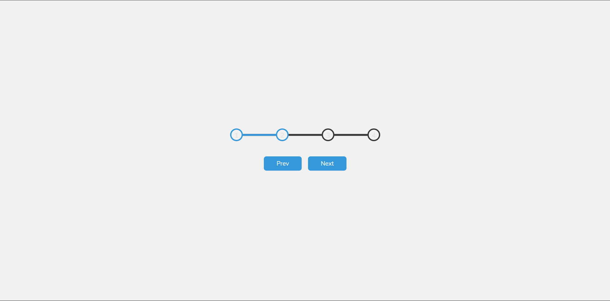

# Day 02 - Progress Steps

An interactive progress tracker UI built with HTML, CSS, and JavaScript.

## Overview

A progress indicator component that displays step circles and a connecting progress bar. Users can navigate through steps using Previous and Next buttons, with the progress bar and step indicators updating dynamically.

## Features

- Step-by-step progress visualization with numbered circles
- Animated progress bar that fills between active steps
- Next and Previous navigation buttons
- Smart button disabling at start and end of progress
- Smooth CSS transitions for progress updates
- Active step highlighting with color change

## Technologies Used

- HTML5
- CSS3
- JavaScript

## What I Learned

- Managing component state with JavaScript variables
- Dynamically updating multiple DOM elements based on state
- Creating pseudo-elements for visual effects (progress bar background)
- Button disable/enable logic based on progress state
- Using CSS custom properties (variables) for consistent theming

## Screenshot

## Live Demo

[View Project](#)

## Project Structure

- `index.html` — project markup with step circles and navigation buttons
- `style.css` — styling, animations, transitions, and progress bar effects
- `script.js` — state management and progress update logic

## How to Run

1. Open `index.html` in a web browser
2. Click the "Next" button to advance through steps
3. Click the "Prev" button to go back to previous steps

## Notes

- The first step (circle 1) starts active by default
- The "Prev" button is disabled at the first step
- The "Next" button is disabled at the final step
- The progress bar width is calculated based on the number of completed steps
- Buttons remain available for intermediate steps

## Credits

Built as part of the `50 Days 50 Projects` challenge.
