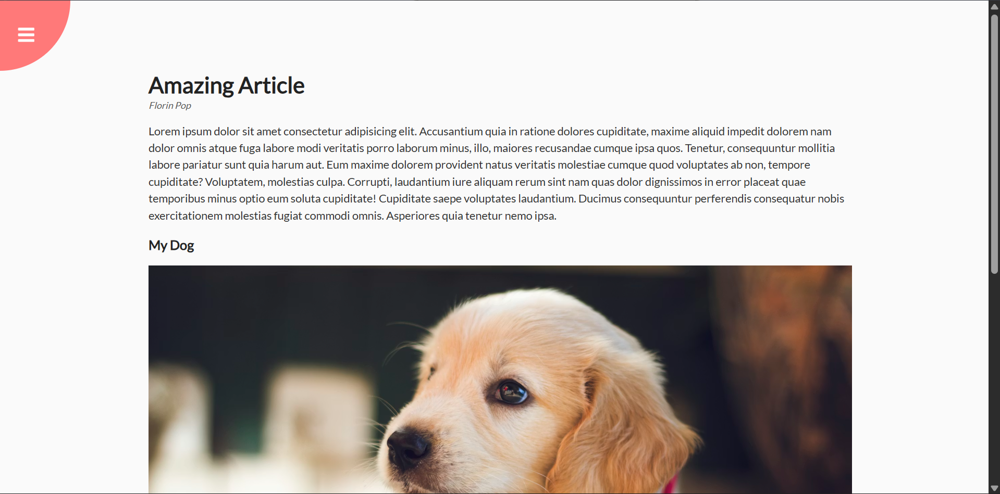

# Day 03 - Rotating Navigation

An interactive navigation menu that rotates and slides into view using CSS transforms and transitions.

## Overview

A rotating navigation component that displays a circular menu button in the top-left corner with a sliding sidebar menu. Clicking the button rotates the page content and animates the navigation menu items into view.

## Features

- Circular menu button with open/close icons
- Rotating animation of main container content
- Sliding navigation menu with smooth transitions
- Navigation items animate in with staggered timing
- Font Awesome icons for menu items
- Responsive design with smooth CSS transitions
- Active state management with JavaScript

## Technologies Used

- HTML5
- CSS3
- JavaScript
- Font Awesome Icons

## What I Learned

- CSS transforms for rotation effects (rotate and skew)
- Transform-origin for controlling rotation points
- Staggered animations using transition-delay
- Managing animation state with CSS classes
- Combining multiple transforms for complex animations
- Creating circular positioned elements with fixed positioning
- Event listeners for opening/closing menu states

## Screenshot

## Live Demo

[View Project](#)

## Project Structure

- `index.html` — semantic markup with circle container, content area, and navigation menu
- `style.css` — styling for animations, transforms, transitions, and layout
- `script.js` — event handlers for opening and closing the navigation menu

## How to Run

1. Open `index.html` in a web browser
2. Click the hamburger menu icon to open the rotating navigation
3. Click the close icon (X) to close the navigation menu
4. Navigate using the menu links (Home, About, Contact)

## Notes

- The container rotates -20 degrees when navigation is open
- The circle button rotates -70 degrees when navigation is open
- Navigation items use translateX to slide in from the left
- Each navigation item has a staggered transition delay for sequential animation
- The page content rotates around the top-left corner (transform-origin: top left)
- Smooth transitions set at 0.5s for the main animations

## Credits

Built as part of the `50 Days 50 Projects` challenge.
