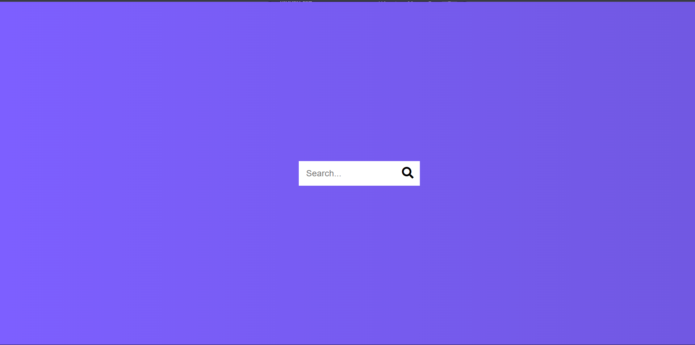

# Day 04 - Hidden Search Widget

An expandable search input that slides into view with smooth CSS transitions and transitions back to a compact circular button.

## Overview

A hidden search widget that displays a compact circular search button with a magnifying glass icon. Clicking the button smoothly expands the search input field to accept user input, and the button icon slides to the right. Perfect for minimalist UI designs.

## Features

- Circular search button with magnifying glass icon
- Smooth expanding animation of search input
- Button slides to the right when search is active
- Placeholder text for user guidance
- Clean, minimalist design with gradient background
- Focus management for improved accessibility
- Responsive layout with flexbox
- Font Awesome icons for visual appeal

## Technologies Used

- HTML5
- CSS3
- JavaScript
- Font Awesome Icons

## What I Learned

- CSS transitions for smooth animations
- Transform properties for translating elements
- Width transitions for expanding inputs
- Active state management with JavaScript classList
- Event listeners for click interactions
- Focus management with input.focus()
- Using Font Awesome icons in buttons
- Flexbox for centering layouts
- CSS gradients for backgrounds
- Positioning absolute and relative elements

## Screenshot

## Live Demo

[View Project](#)

## Project Structure

- `index.html` — semantic markup with search container, input field, and search button
- `style.css` — styling for animations, transitions, layout, and gradient background
- `script.js` — event handler for toggling search active state and managing focus

## How to Run

1. Open `index.html` in a web browser
2. Click the magnifying glass icon to expand the search input
3. Type your search query in the input field
4. Click the icon again to collapse the search widget

## Notes

- The input expands from 50px to 200px width when active
- The search button translates 198px to the right when search is active
- All transitions use 0.3s ease timing for smooth animations
- The component uses a purple gradient background (90deg, #7d5fff to #7158e2)
- Input and button elements have no outline on focus for a clean appearance
- The layout is centered both vertically and horizontally on the page using flexbox

## Credits

Built as part of the `50 Days 50 Projects` challenge.
