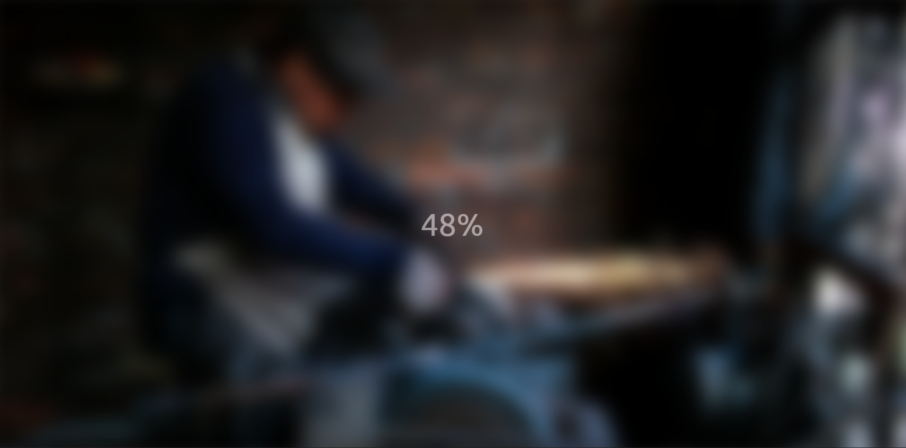

# Day 05 - Blurry Loading

An animated loading screen that progressively clears a blurred background image as the percentage counter advances.

## Overview

A loading animation that simulates a loading state by displaying a percentage counter while the background image transitions from a fully blurred state to a clear image. As the counter increments from 0% to 100%, the blur effect decreases in real-time.

## Features

- Animated percentage counter (0% to 100%)
- Progressive blur removal on background image
- Fading text opacity as loading progresses
- Smooth 30ms interval animations
- Responsive full-viewport design
- Clean and minimal UI
- Dynamic value scaling using range mapping

## Technologies Used

- HTML5
- CSS3
- JavaScript
- Unsplash API for background image

## What I Learned

- CSS filter blur property for image effects
- JavaScript setInterval for continuous animations
- Dynamic style updates using JavaScript
- Opacity transitions during loading
- Math-based range mapping for value scaling
- Positioning absolute elements on full viewport
- Combining multiple CSS properties for cohesive animation
- Using filter effects for image manipulation

## Screenshot

## Live Demo

[View Project](#)

## Project Structure

- `index.html` — semantic markup with background section and loading text display
- `style.css` — styling for full-viewport layout, background image, and text positioning
- `script.js` — animation logic for percentage counter and blur effect progression

## How to Run

1. Open `index.html` in a web browser
2. The animation starts automatically upon page load
3. Watch as the percentage counter increments from 0% to 100%
4. Observe the background image becoming progressively clearer
5. The loading completes when the counter reaches 100%

## Notes

- The animation runs at 30ms intervals (approximately 3 seconds for full completion)
- The blur effect ranges from 30px (fully blurred) to 0px (completely clear)
- The loading text opacity fades from 1 (fully visible) to 0 (invisible) as loading progresses
- A custom scale function maps the 0-100 percentage range to the blur and opacity ranges
- The background image is positioned with offset coordinates to account for the blur effect
- setInterval is cleared when the counter exceeds 99 to stop the animation

## Credits

Built as part of the `50 Days 50 Projects` challenge.
