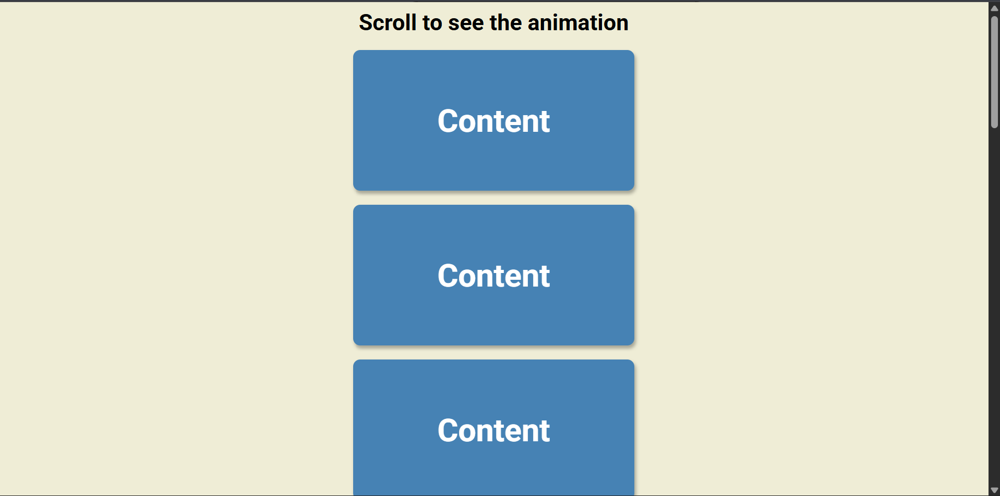

# Day 06 - Scroll Animation

An animated scrolling effect that reveals content boxes with smooth sliding transitions as they come into the viewport.

## Overview

A scroll animation project that detects when content boxes enter the viewport and applies smooth sliding animations. Boxes slide in from the sides with a staggered timing, creating an engaging visual effect that enhances page scrolling experience. Odd-numbered boxes slide from right to left, while even-numbered boxes slide from left to right.

## Features

- Scroll event detection for dynamic animations
- Smooth sliding animations from both left and right sides
- Viewport-based trigger points (80% of window height)
- Staggered animation timing using nth-of-type selectors
- Responsive design with centered layout
- Real-time DOM class manipulation
- CSS transitions for fluid motion
- Multiple content boxes with automatic animation

## Technologies Used

- HTML5
- CSS3
- JavaScript
- Google Fonts (Roboto)

## What I Learned

- Window scroll event listeners for detecting viewport position
- getBoundingClientRect() for calculating element positions
- Dynamic DOM class addition/removal based on scroll position
- CSS transform properties for sliding animations
- Using nth-of-type selectors for alternating animation directions
- CSS transitions for smooth animation effects
- Calculating viewport trigger points
- Combining JavaScript scroll logic with CSS transitions
- querySelector and querySelectorAll for DOM selection
- Efficient animation performance with classList methods

## Screenshot

## Live Demo

[View Project](#)

## Project Structure

- `index.html` — semantic markup with multiple content boxes
- `style.css` — styling for layout, animations, and visual effects
- `script.js` — scroll event logic for detecting and triggering animations

## How to Run

1. Open `index.html` in a web browser
2. The page displays a heading and multiple content boxes
3. Scroll down the page to see the animation effects
4. Boxes animate in as they reach 80% down the viewport
5. Odd boxes slide from right to left, even boxes slide from left to right

## Notes

- The trigger point is set at 80% of the window height (innerHeight / 5) \* 4
- Odd-numbered boxes start with `translateX(400%)` (off-screen to the right)
- Even-numbered boxes start with `translateX(-400%)` (off-screen to the left)
- Animated boxes receive the `show` class which applies `translateX(0)`
- Transition duration is 0.4 seconds with ease timing
- Boxes remain visible and do not animate back out when scrolling up
- The animation runs on every scroll event for real-time updates

## Credits

Built as part of the `50 Days 50 Projects` challenge.
