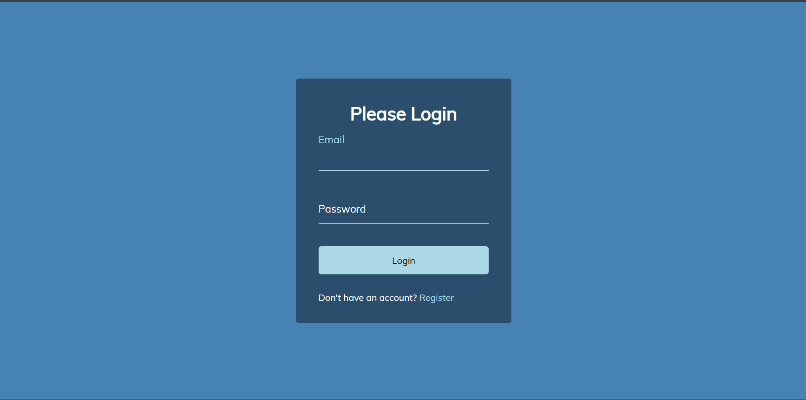

# Day 08 - Wave Form Animation

A clean login form that animates label text into a wave on focus, creating a subtle, modern input interaction.

## Overview

This project demonstrates an animated form input where each label's characters are split into individual spans and given staggered transition delays. When an input gains focus or contains a value, the label letters move upward in a wave-like motion, providing a polished UI micro-interaction.

## Features

- Per-letter label animation with staggered delays
- Smooth translate and color transitions on focus/valid states
- Accessible HTML5 form controls with `required` validation
- Minimal, responsive layout suitable for small forms
- CSS-only transitions for most visual effects
- Lightweight JavaScript for label splitting and delay assignment

## Technologies Used

- HTML5
- CSS3 (transitions, transforms)
- JavaScript (ES6)

## What I Learned

- Splitting text into spans for per-letter animation
- Using CSS transition delays to create wave effects
- Combining focus and validity selectors for UX polish
- Layering z-index and positioning for clean label/input interactions
- Keeping animations performant with transform and opacity

## Screenshot

## Live Demo

[View Project](#)

## Project Structure

- `index.html` — semantic markup for the login form and labels
- `style.css` — styling for layout, inputs, and label animations
- `script.js` — logic to split label text and apply staggered delays

## How to Run

1.  Open `index.html` in a web browser
2.  Focus an input field to trigger the wave animation
3.  Type to see the label remain elevated (valid state)

## Notes

- Labels are split into spans with `transition-delay` increments of 50ms by default
- The wave effect is driven by CSS transform and color transitions
- Inputs use the `required` attribute so the `:valid` selector can hold the label in place after typing
- The JavaScript is intentionally minimal and runs on DOM load to enhance progressive enhancement

## Credits

Built as part of the `50 Days 50 Projects` challenge.
