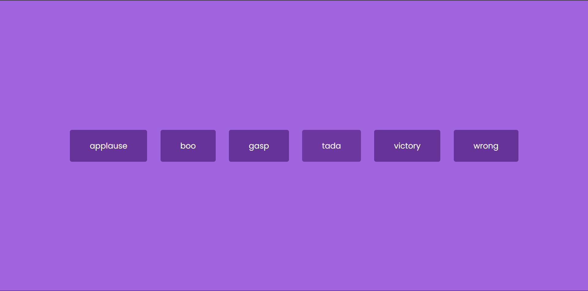

# Day 9 - Sound Board

A simple interactive sound board with clickable buttons that play fun audio effects instantly.

## Overview

This project demonstrates how to use HTML5 audio elements with JavaScript to create a responsive soundboard interface. The main goal was to build a lightweight, accessible interaction pattern where each button plays a unique sound while stopping any currently playing audio.

## Features

- Clickable sound buttons for immediate audio playback
- Stops currently playing audio before starting a new sound
- Minimal responsive UI suitable for small screens
- Accessible HTML5 audio elements with keyboard-friendly buttons
- Clean visual styling with hover and focus states
- Lightweight JavaScript logic for behavior

## Technologies Used

- HTML5
- CSS3
- JavaScript (ES6+)

## What I Learned

- How to wire HTML5 `<audio>` elements to button interactions
- Using `pause()` and `currentTime` to reset audio playback
- Building a reusable sound list with `forEach`
- Structuring simple UI with accessible controls
- Keeping visual styling lightweight and responsive

## Screenshot

## Live Demo

[View Project](#)

## Project Structure

- `index.html` — Main HTML file containing audio elements and the button container
- `style.css` — Visual styling for the soundboard layout and button states
- `script.js` — JavaScript logic to generate buttons and control audio playback

## How to Run

1.  Open `index.html` in a web browser or start a local server
2.  Click any sound button to play that audio clip
3.  Observe that the previous sound stops before the new one starts

## Notes

- Buttons are generated dynamically from the `sounds` array in `script.js`
- Each audio clip is stopped and reset with `pause()` and `currentTime = 0`
- The UI uses `flex` layout to center buttons in the viewport
- JavaScript is intentionally minimal and runs after DOM load

## Credits

Built as part of the `50 Days 50 Projects` challenge.
