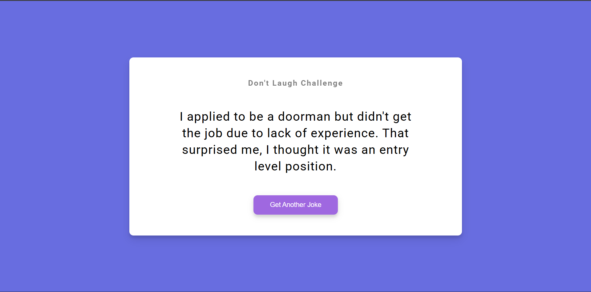

# Day 10 - Dad Jokes

A playful dad joke generator that fetches a random joke from an API and updates the page with a single button click.

## Overview

This project demonstrates how to build a simple interactive frontend using HTML, CSS, and JavaScript. The main goal was to create an engaging, lightweight UI that fetches and displays a new joke without reloading the page.

## Features

- Fetches random dad jokes from the `icanhazdadjoke.com` API
- Displays jokes in a clean, centered card layout
- Button triggers a new joke request with a smooth visual response
- Responsive design that works well on smaller screens
- Minimal CSS styling with polished card shadows and button states
- Lightweight JavaScript using async/await for fetch logic

## Technologies Used

- HTML5
- CSS3
- JavaScript (ES6+)

## What I Learned

- How to fetch JSON from a third-party API using `fetch`
- Using `async`/`await` to keep asynchronous code readable
- Styling a card-based layout with shadows and rounded corners
- Keeping UI interactions lightweight and accessible
- Updating DOM content dynamically based on API responses

## Screenshot

## Live Demo

[View Project](#)

## Project Structure

- `index.html` — main page markup and structure
- `style.css` — visual styling for layout, typography, and button states
- `script.js` — joke-fetching logic and DOM update behavior

## How to Run

1.  Open `index.html` in a web browser or start a local server
2.  Click the "Get Another Joke" button
3.  Observe the new joke appear in the card area

## Notes

- The joke is fetched from `https://icanhazdadjoke.com` with an `Accept: application/json` header
- The button uses JavaScript event listeners to trigger joke refreshes
- The layout is intentionally simple and centered for a distraction-free experience
- The JavaScript is intentionally minimal and runs after page load

## Credits

Built as part of the `50 Days 50 Projects` challenge.
