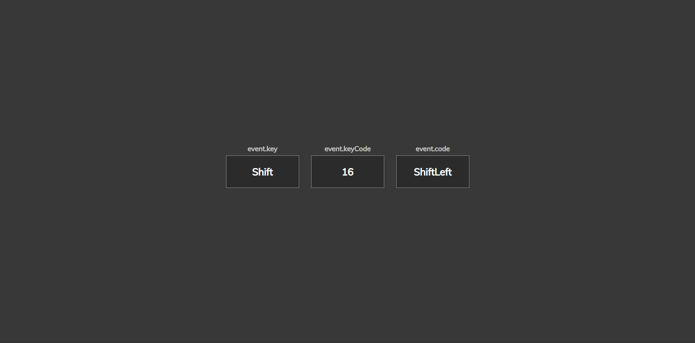

# Day 11 - Event KeyCodes

A simple interactive demo that listens for keyboard input and displays the captured key, key code, and physical key location in a modern card layout.

## Overview

This project demonstrates handling keyboard events with JavaScript and dynamically updating the DOM based on user input. The main goal was to create a clean, responsive interface that shows how key presses map to `event.key`, `event.keyCode`, and `event.code`.

## Features

- Real-time keyboard event detection
- Dynamic card-based display for key details
- Handles the Space key with a friendly label
- Minimal responsive layout for all screen sizes
- Clean visual styling with subtle shadows and contrast
- Lightweight JavaScript for logic and enhancement

## Technologies Used

- HTML5
- CSS3
- JavaScript (ES6+)

## What I Learned

- Using `keydown` to capture keyboard events globally
- Updating the DOM with template literals for clean markup
- Handling special keys like Space gracefully in the UI
- Structuring a small UI with reusable card components
- Keeping the JavaScript minimal while preserving interactivity

## Screenshot

## Live Demo

[View Project](#)

## Project Structure

- `index.html` — Main page markup and container for the interactive key display
- `style.css` — Visual styling, layout, and card design
- `script.js` — Keyboard event handling and DOM updates

## How to Run

1.  Open `index.html` in a web browser or start a local server
2.  Press any key to trigger the event display
3.  Observe the displayed `event.key`, `event.keyCode`, and `event.code`

## Notes

- The display updates on every `keydown` event with new key information
- The Space key is shown as `Space` instead of an empty character
- The effect is driven by JavaScript DOM manipulation and CSS card styling
- The JavaScript is intentionally minimal and runs on DOM load

## Credits

Built as part of the `50 Days 50 Projects` challenge.
