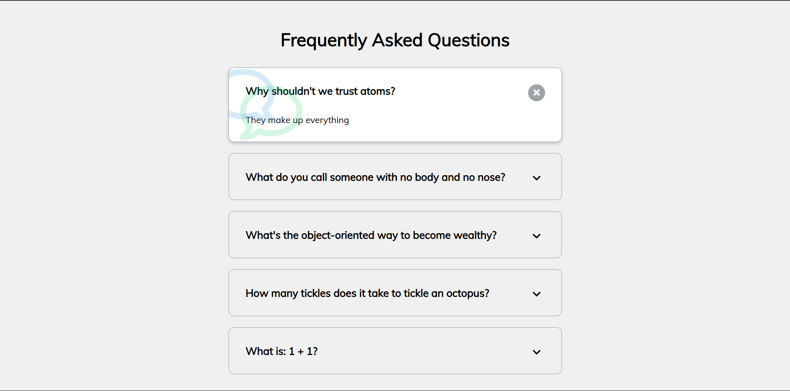

# Day 12 - FAQ Collapse

A collapsible FAQ accordion interface where users can expand and collapse answers with smooth animations and interactive visual feedback.

## Overview

This project demonstrates creating an accordion/collapse interface using HTML structure, CSS styling for state management, and minimal JavaScript for toggling. The main goal was to build an interactive FAQ section that elegantly reveals and hides content while providing clear visual feedback.

## Features

- Click-to-expand/collapse individual FAQ items
- Smooth CSS transitions between open and closed states
- Active state styling with decorative background icons
- Icon switching between chevron-down (collapsed) and times/X (expanded)
- Multiple FAQ items can be open simultaneously
- Responsive layout centered on the page
- Shadow and background color changes on active state
- Intuitive toggle button positioned at top-right of each item

## Technologies Used

- HTML5
- CSS3 (transitions, transforms, positioning, pseudo-elements)
- JavaScript (ES6+ querySelector, event listeners)
- Font Awesome 5 Icons

## What I Learned

- Using the "active" class pattern for state management in vanilla JavaScript
- CSS transitions to create smooth visual effect changes
- Pseudo-elements (::before, ::after) for decorative background icons
- Toggling classes with JavaScript click event handlers
- Combining display properties with transitions for content visibility
- Icon switching by hiding/showing different Font Awesome icons based on state
- Layering z-index and positioning for clean button placement over content
- Using absolute positioning for overlay icons and interactive elements

## Screenshot

## Live Demo

[View Project](#)

## Project Structure

- `index.html` — Markup with FAQ container and individual FAQ items with toggle buttons
- `style.css` — Styling for layout, transitions, state-based styling, and icon positioning
- `script.js` — Event listener logic to toggle active class on click

## How to Run

1. Open `index.html` in a web browser or start a local server
2. Click on any FAQ title or the toggle button to expand/collapse the answer
3. Observe the smooth transitions and icon changes as items open and close
4. Multiple items can be open at the same time

## Notes

- The first FAQ item has the "active" class by default in the HTML, so it displays opened on page load
- Each FAQ item has a `faq-toggle` button with two icons: a chevron-down (collapsed state) and a times icon (expanded state)
- The active state applies a white background, box-shadow, and changes the button to a gray background color
- Decorative comment bubble icons appear behind expanded items via CSS pseudo-elements with opacity for subtle visual enhancement
- The JavaScript uses `parentNode.classList.toggle("active")` to toggle state on the entire FAQ container
- All animations use CSS `transition: 0.3s ease;` for consistent timing

## Credits

Built as part of the `50 Days 50 Projects` challenge.
