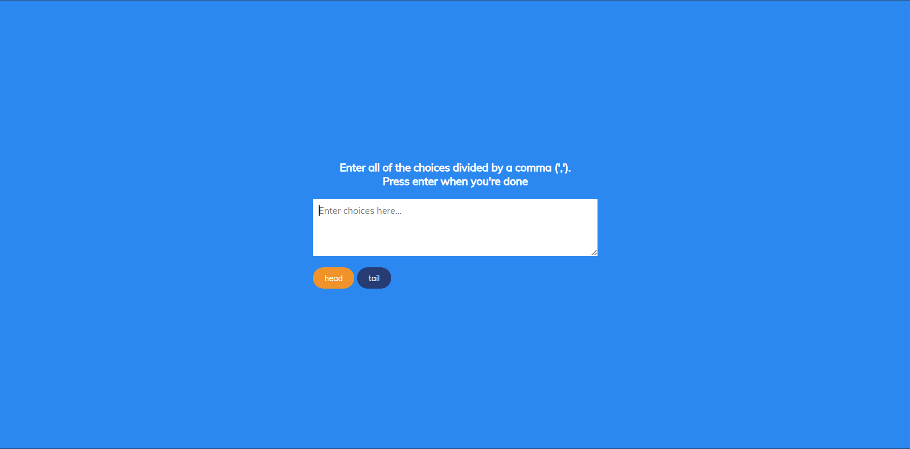

# Day 13 - Random Choice Picker

A lightweight decision-making tool that lets you input multiple choices and randomly selects one with a smooth animated selection animation.

## Overview

This project demonstrates DOM manipulation, event handling, and animation timing in vanilla JavaScript. The main goal was to create an interactive UI that takes user input, dynamically generates visual elements, and performs timed animations to create a satisfying "spinning" effect before landing on a random choice.

## Features

- Dynamic tag generation from comma-separated input
- Real-time tag creation and display as user types
- Smooth animated random selection with visual highlighting
- Fast cycling animation followed by final choice selection
- Responsive design that works on various screen sizes
- Clean, intuitive user interface
- Lightweight implementation with no external dependencies

## Technologies Used

- HTML5
- CSS3 (flexbox, transitions, animations)
- JavaScript (ES6+)

## What I Learned

- DOM manipulation with `createElement`, `classList`, and `innerHTML`
- Event listener implementation for keyboard interactions (Enter key detection)
- Using `setInterval` and `setTimeout` for controlling animation timing and sequences
- Array methods (`split`, `filter`, `map`, `forEach`) for data processing
- Using `Math.random()` with array length for random selection
- CSS transitions for smooth highlight effects
- Creating engaging UX through well-timed animations

## Screenshot

## Live Demo

[View Project](#)

## Project Structure

- `index.html` — HTML markup with textarea input and tags container
- `script.js` — JavaScript logic for tag creation, event handling, and random selection animation
- `style.css` — Styling for layout, colors, animations, and responsive design

## How to Run

1. Open `index.html` in a web browser
2. Type multiple choices separated by commas in the textarea (e.g., "Pizza,Tacos,Sushi,Burger")
3. Press Enter to start the random selection animation
4. Watch as the choices are randomly highlighted before landing on the final selection
5. Enter new choices to pick again

## Notes

- The random selection animation runs for 3 seconds (30 cycles × 100ms), highlighting tags rapidly
- After the animation completes, one random tag remains highlighted as the final choice
- Tags are trimmed of whitespace and empty entries are filtered out
- The textarea automatically clears after pressing Enter for the next input
- Clicking the textarea gives it focus by default for immediate input

## Credits

Built as part of the `50 Days 50 Projects` challenge.
