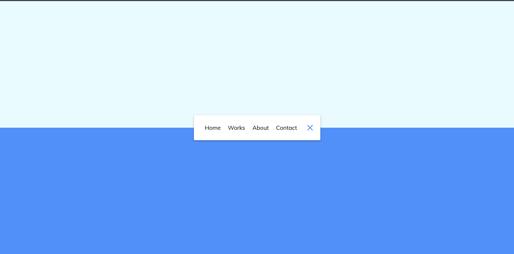

# Day 14 - Animated Navigation

An animated sidebar navigation that expands into a full menu with a playful icon toggle interaction.

## Overview

This project demonstrates a compact navigation pattern that expands into a wider menu on click. The main goal was to create an engaging, animated header navigation with minimal JavaScript and smooth CSS transitions.

## Features

- Click-to-toggle navigation expansion
- Rotating menu item reveal animation
- Animated hamburger icon transformation
- Lightweight responsive layout for small screens
- CSS-driven transitions for most visual effects
- Minimal JavaScript for toggle behavior

## Technologies Used

- HTML5
- CSS3 (transitions, transforms)
- JavaScript (ES6+)

## What I Learned

- How to animate element width and visibility using CSS transitions
- Using transform and opacity for smooth reveal effects
- Creating an animated toggle icon with CSS transform rotations
- Keeping interactivity lightweight with one event listener
- Designing a simple and intuitive expanding navigation UI

## Screenshot

## Live Demo

[View Project](#)

## Project Structure

- `index.html` — project markup for navigation and toggle button
- `style.css` — styling, layout, and animated transitions
- `script.js` — toggle logic for adding and removing the active class

## How to Run

1.  Open `index.html` in a web browser or start a local server
2.  Click the toggle button to expand the navigation menu
3.  Observe the menu items and icon animation

## Notes

- The menu expands from a compact sidebar to a full-width navigation using `width` transition
- Menu links reveal with a rotateY and opacity animation when the nav becomes active
- The icon lines rotate into an X-like shape using CSS transforms
- JavaScript is intentionally minimal and only toggles the `active` class

## Credits

Built as part of the `50 Days 50 Projects` challenge.
