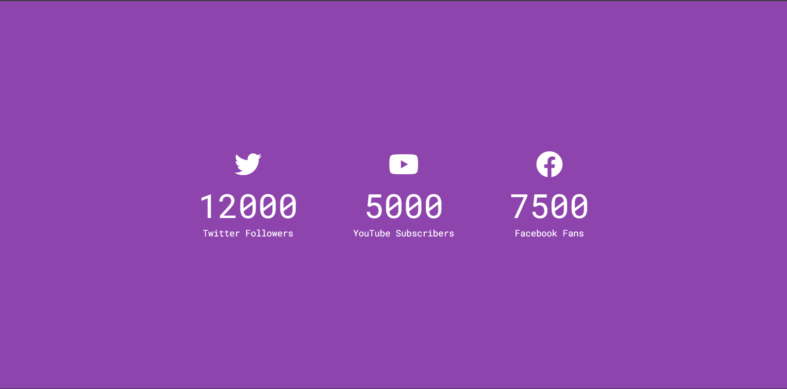

# Day 15 - Incrementing Counter

Animated counter that smoothly increments from 0 to target values, creating a visually engaging way to display growing statistics like social media followers.

## Overview

This project demonstrates smooth number animation using JavaScript timing functions. The main goal was to create an engaging visual effect that animates counters incrementally toward target values, commonly used to display impressive statistics on landing pages or dashboards.

## Features

- Per-element animated counters with synchronized timing
- Smooth increment calculations for natural progression
- Social media icon integration using Font Awesome
- Responsive layout that adapts to smaller screens
- Flexible data-driven approach using HTML data attributes
- Lightweight, performant JavaScript with minimal dependencies
- Clean, purple gradient design with centered layout

## Technologies Used

- HTML5
- CSS3 (flexbox, media queries, responsive design)
- JavaScript (ES6+, DOM manipulation, setTimeout)
- Font Awesome Icons (CDN)
- Google Fonts (Roboto Mono)

## What I Learned

- Using `data-` attributes to pass target values from HTML to JavaScript
- Calculating smooth increments based on target values (target / 200 for smooth animation)
- Implementing recursive `setTimeout()` for frame-by-frame animation
- Converting strings to numbers with unary `+` operator
- Using `Math.ceil()` to round up incremented values
- Iterating over NodeList with `forEach()` for applying logic to multiple elements
- Responsive design breakpoints for mobile and tablet views
- Combining multiple icons and stats in a flexible container layout

## Screenshot

## Live Demo

[View Project](#)

## Project Structure

- `index.html` — Markup with three counter containers featuring social media icons and data attributes for target values
- `style.css` — Styling with flexbox layout, gradient background, typography, and mobile responsiveness
- `script.js` — Animation logic that increments counters smoothly toward their targets using setTimeout

## How to Run

1. Open `index.html` in a web browser or start a local server
2. Watch the counters automatically animate from 0 to their target values
3. Refresh the page to see the animation run again
4. Resize the window to test responsive behavior on smaller screens

## Notes

- The increment amount is calculated as `target / 200`, creating a consistent 200-frame animation regardless of target value size
- Animation runs with a 1ms `setTimeout` delay between increments for smooth performance
- Each counter is independent and runs its own animation loop
- The final `counter.innerText = target` assignment ensures the exact target value is displayed
- Uses `Math.ceil()` to round up intermediate values, ensuring smooth visual progression
- CSS media query at 580px width adjusts layout from horizontal to vertical for mobile devices
- Font Awesome CDN provides professional social media icons

## Credits

Built as part of the `50 Days 50 Projects` challenge.
