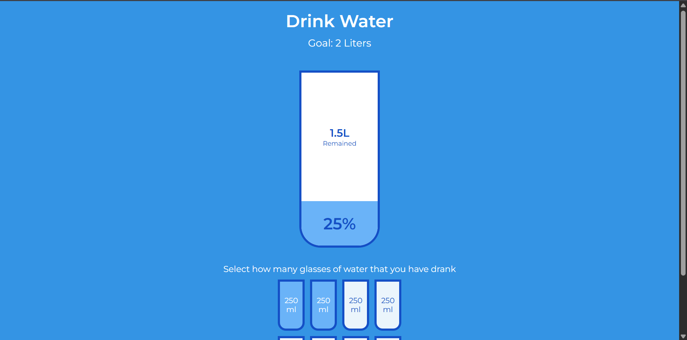

# Day 16 - Drink Water

Track your daily water intake with an interactive visual display that fills as you log each glass of water consumed.

## Overview

This project demonstrates a progress tracking interface where users can monitor their hydration goals. The main goal was to create an intuitive way to visualize water consumption toward a 2-liter daily target using interactive cup elements that update in real-time.

## Features

- **Interactive Cup Selection**: Click on small cup containers to mark water consumed (250ml per cup)
- **Real-Time Progress Visualization**: Large cup fills with blue color as intake increases
- **Percentage Display**: Shows completion percentage of the 2-liter goal
- **Remaining Liters Calculation**: Dynamically updates remaining water needed
- **Smart Toggle Logic**: Click behavior intelligently toggles cups and prevents over-selection
- **Smooth Animations**: CSS transitions create fluid fill and visibility changes
- **Responsive Layout**: Centered design works well on various screen sizes

## Technologies Used

- **HTML5**: Semantic markup for water tracking interface
- **CSS3** (transitions, flexbox, positioning)
- **JavaScript (ES6+)**: Event handling and real-time calculations

## What I Learned

- **DOM Manipulation**: Using `querySelectorAll()` and `classList` to manage element states efficiently
- **Event Delegation**: Adding click listeners to multiple elements with forEach loops
- **Conditional Logic**: Implementing smart toggle behavior to prevent unintended states
- **Responsive Calculations**: Computing percentages and remaining values dynamically based on user input
- **Visibility Control**: Using `visibility`, `height`, and transitions to show/hide elements smoothly
- **Flexible Layout**: Using flexbox to center and arrange components responsively

## Screenshot

## Live Demo

[View Project](#)

## Project Structure

- `index.html` — HTML markup with the main cup display and small cup grid
- `style.css` — Styling for cups, layout, colors, and smooth transitions
- `script.js` — Event handlers, state management, and percentage/remaining calculations

## How to Run

1. Open `index.html` in a web browser or start a local server
2. Click on any of the small cups (250ml each) to mark water consumed
3. Watch the large cup fill and the remaining liters update
4. Continue until you reach the 2-liter goal (all 8 cups filled)

## Notes

- **Goal**: 8 cups × 250ml = 2,000ml (2 liters)
- **Toggle Logic**: Clicking a filled cup deselects it and all cups after it; clicking an empty cup after filled cups fills up to that point
- **Visual Feedback**: The large cup percentage section only appears when at least one small cup is selected
- **Display**: The "Remained" text hides when the goal is reached
- **Transitions**: All state changes use 0.3s ease transitions for smooth visual feedback
- **Color Variables**: Using CSS custom properties (`--border-color`, `--fill-color`) for easy theme adjustments

## Credits

Built as part of the `50 Days 50 Projects` challenge.
