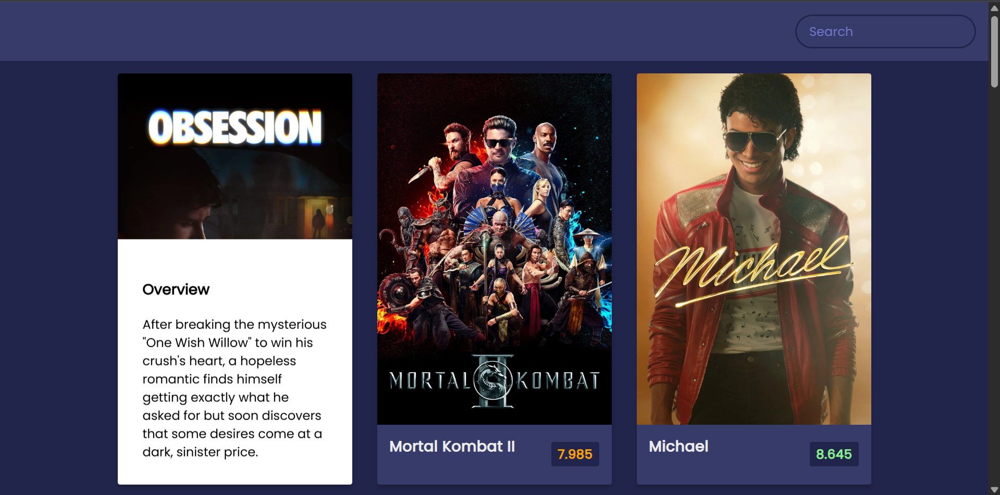

# Day 17 - Movie App

A dynamic movie discovery app that fetches popular movies from The Movie Database API and allows users to search for specific titles with beautiful card-based UI and interactive hover effects.

## Overview

This project demonstrates fetching data from a third-party REST API and rendering dynamic content based on user interactions. The main goal was to build a functional movie discovery application with real-time search capabilities and responsive design.

## Features

- Real-time search functionality with instant API calls
- Display of popular movies with ratings and overviews
- Color-coded movie ratings (green ≥8, orange ≥5, red <5)
- Interactive hover effect revealing full movie overview
- Responsive grid layout that adapts to screen size
- API integration with The Movie Database (TMDB)
- Clean, modern UI with smooth transitions
- Form submission handling with input validation

## Technologies Used

- HTML5
- CSS3 (flexbox, transitions, transforms, z-index layering)
- JavaScript (ES6+, async/await, fetch API)
- The Movie Database (TMDB) API

## What I Learned

- Using async/await with fetch API for handling asynchronous data requests
- Dynamic DOM manipulation with `createElement()` and template literals
- Conditional styling based on data values (rating-based color coding)
- CSS transforms and positioning for overlay effects on hover
- Form event handling and input validation
- API endpoint construction and query parameters
- Error handling in fetch requests and data processing
- Responsive design with flexbox wrapping and centered layouts

## Screenshot

## Live Demo

[View Project](#)

## Project Structure

- `index.html` — Main HTML structure with search form and content container
- `script.js` — JavaScript logic for API calls, DOM manipulation, and event handling
- `style.css` — Styling for layout, cards, animations, and responsive design

## How to Run

1. Open `index.html` in a web browser or use a local server
2. The app will automatically load popular movies on page load
3. Use the search box to find movies by title
4. Hover over any movie card to see the full overview
5. Click the search box and clear it to return to the popular movies list

## Notes

- The API key is hardcoded in the script (consider using environment variables for production)
- Movies are fetched from TMDB's discover endpoint sorted by popularity
- Image paths use TMDB's image CDN with 1280px width for crisp display
- The rating span dynamically applies CSS classes (green, orange, red) for color coding
- Overview panel uses `transform: translateY()` for smooth slide-up animation on hover
- Search submits the form and resets the input field after each query
- The app reloads the popular movies list when search input is cleared

## Credits

Built as part of the `50 Days 50 Projects` challenge.
