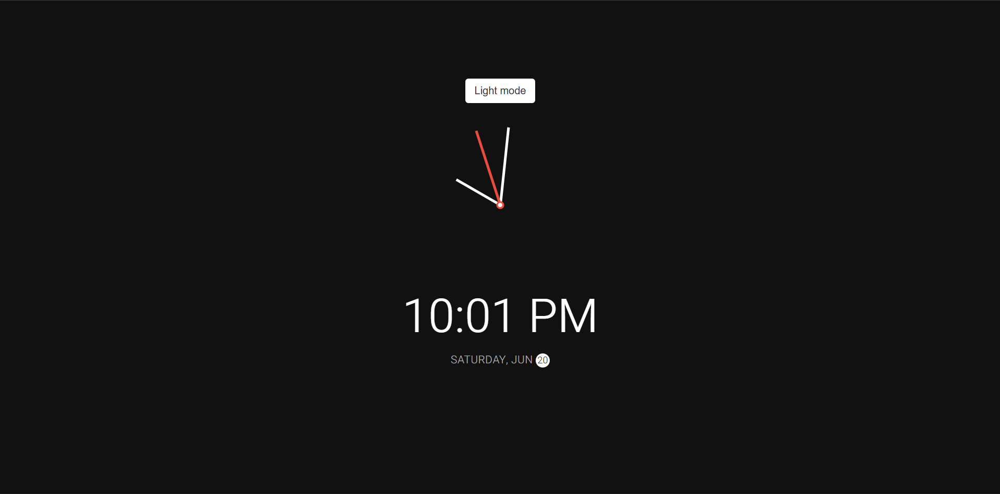

# Day 19 - Theme Clock

A functional analog clock with real-time updates that supports both light and dark themes with smooth transitions.

## Overview

This project demonstrates how to create an analog clock using JavaScript date objects and CSS transforms, with a smooth theme-switching functionality. The main goal was to build an interactive, real-time clock interface with proper angle calculations and dynamic theming.

## Features

- Real-time analog clock with hour, minute, and second needles
- Dark/light theme toggle with smooth transitions
- Digital time display with AM/PM indicator
- Current date display with day name and highlighted date circle
- CSS transform-based needle rotation for smooth animations
- Responsive clock container with flexible layout

## Technologies Used

- HTML5
- CSS3 (CSS variables, transforms, transitions)
- JavaScript (ES6+, Date API)

## What I Learned

- Using a scale function to map time values to rotation degrees
- CSS custom properties for dynamic theming without reloading
- Smooth transitions with transform-origin for proper rotation pivot
- Using transform and opacity for better animation performance
- Updating DOM elements in real-time with setInterval

## Screenshot

## Live Demo

[View Project](#)

## Project Structure

- `index.html` — HTML structure with clock elements, toggle button, and time/date display
- `style.css` — Styling for clock face, needles, theme variables, and responsive layout
- `script.js` — JavaScript logic for time calculation, needle rotation, and theme toggle

## How to Run

1. Open `index.html` in a web browser or start a local server
2. Click the "Dark mode" button to toggle between light and dark themes
3. Watch the clock needles update in real-time showing the current time

## Notes

- The `scale()` function converts time values (0-12 for hours, 0-60 for minutes/seconds) to rotation degrees (0-360)
- CSS custom properties (`--primary-color`, `--secondary-color`) enable instant theme switching without DOM manipulation
- Needle transforms use `translate(-50%, -100%) rotate()` to ensure proper pivot from the top center
- The setInterval updates every 1000ms (1 second) for smooth real-time updates
- The second needle has a distinct red color (#e74c3c) for visual emphasis and easy identification
- The date circle uses a circular badge design with contrasting colors that adapt to the theme

## Credits

Built as part of the `50 Days 50 Projects` challenge.
