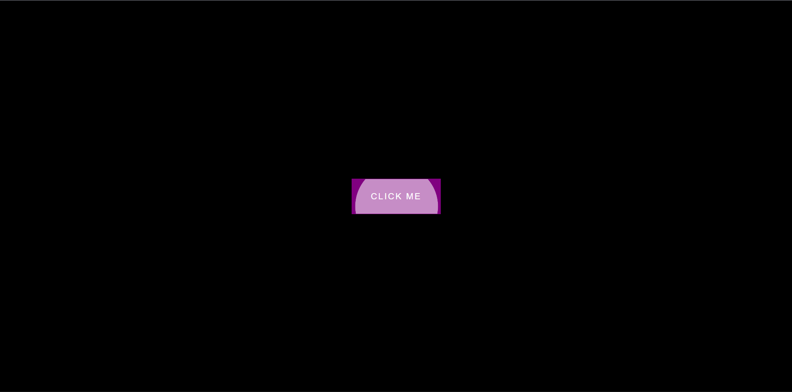

# Day 20 - Button Ripple Effect

A sleek material design-inspired ripple effect that emanates from the exact click point on a button, creating an elegant visual feedback for user interactions.

## Overview

This project demonstrates a modern ripple animation technique commonly seen in Material Design interfaces. The main goal was to master dynamic element creation, position calculations relative to click coordinates, and CSS keyframe animations combined with JavaScript event handling.

## Features

- Click-responsive ripple animation originating from cursor position
- Dynamic circle elements created on each button click
- Smooth scale and fade animation using CSS keyframes
- Automatic cleanup of ripple elements after animation completes
- Purple button styling on dark background for strong visual contrast
- Minimal, lightweight implementation with pure CSS and vanilla JavaScript
- No external dependencies required

## Technologies Used

- HTML5
- CSS3 (animations, transforms, keyframes)
- JavaScript (ES6+)

## What I Learned

- Calculating click coordinates relative to the button's position using `pageX/pageY` and `offsetTop/offsetLeft`
- Dynamically creating and positioning DOM elements at runtime
- Using `transform: translate(-50%, -50%)` to center elements from their top-left corner
- Combining `scale()` transforms with `opacity` changes for smooth material design effects
- Automatic DOM cleanup using `setTimeout()` to remove elements after animations complete
- Leveraging CSS animations with `ease-out` timing for natural motion
- Using `overflow: hidden` on the button to clip ripples at button boundaries

## Screenshot

## Live Demo

[View Project](#)

## Project Structure

- `index.html` — Markup with a clickable button element
- `style.css` — Button styling, ripple element styles, and keyframe animations
- `script.js` — Event listener logic for click detection and ripple element creation

## How to Run

1. Open `index.html` in a web browser or use a local HTTP server
2. Click anywhere on the button to trigger the ripple effect
3. Watch the ripple expand and fade from your exact click point
4. Click multiple times to see overlapping ripple animations

## Notes

- The ripple animation takes 500ms to complete; elements are removed from DOM after this duration
- Click coordinates are calculated by subtracting the button's offset position from the page-relative click position
- Each ripple starts with `scale(0)` and animates to `scale(3)` while fading to `opacity: 0`
- The animation uses `ease-out` timing to decelerate smoothly toward the end
- The button's `overflow: hidden` property ensures ripples don't extend beyond button boundaries
- The white ripple color contrasts strongly against the purple button background

## Credits

Built as part of the `50 Days 50 Projects` challenge.
