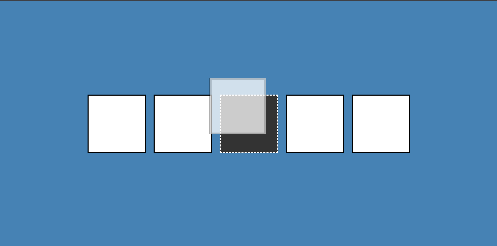

# Day 21 - Drag N Drop

A small interactive UI where a single image tile can be dragged between multiple drop zones, with clear visual hover and hold states.

## Overview

This project demonstrates HTML5 drag-and-drop to move a draggable element between several drop targets. The main goal was to practice handling drag events and providing clear visual feedback during drag interactions while keeping the implementation minimal and responsive.

## Features

- Single draggable image tile using the HTML5 `draggable` attribute
- Multiple drop zones that accept the draggable element
- Visual `hold` and `hovered` states while dragging
- Minimal, responsive layout suitable for small screens
- CSS-driven visual feedback for interactions
- Lightweight JavaScript for drag logic and DOM manipulation

## Technologies Used

- HTML5
- CSS3 (transitions, responsive layout)
- JavaScript (ES6+)

## What I Learned

- How the `dragstart` and `dragend` events control element state during drag
- Using a brief `setTimeout` to change classes so the drag image/ghost behaves correctly
- Handling `dragover`, `dragenter`, `dragleave`, and `drop` to manage drop zones
- Keeping DOM updates minimal and focused on class toggles for visual feedback
- Building a responsive layout with flexbox for simple grid-like placement

## Screenshot

## Live Demo

[View Project](#)

## Project Structure

- `index.html` — Main HTML markup and layout
- `style.css` — Styles for the drop zones, draggable tile, and responsive layout
- `script.js` — Drag-and-drop logic and event handlers

## How to Run

1.  Open `index.html` in a web browser or start a local server
2.  Click and drag the image tile to another empty box to move it
3.  Observe the visual `hold` and `hovered` states while dragging

## Notes

- `dragstart` uses a `setTimeout` to swap classes so the browser drag image behaves as intended
- Drop zones prevent default behavior on `dragover` and `dragenter` so drops are allowed
- Visual feedback is implemented with CSS classes (`hold`, `hovered`) for simplicity
- The JavaScript is intentionally minimal and runs on DOM events

## Credits

Built as part of the `50 Days 50 Projects` challenge.
