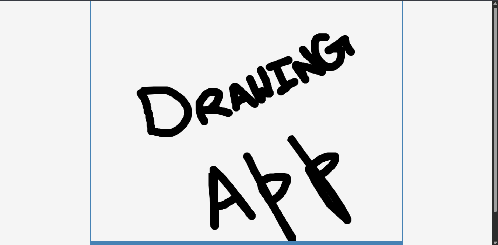

# Day 22 - Drawing App

A simple canvas-based drawing app that lets users paint with adjustable brush size and color directly in the browser.

## Overview

This project demonstrates interactive HTML5 canvas drawing with dynamic brush controls. The main goal was to build a clean drawing UI that makes sketching easy with adjustable stroke size, color selection, and a clear option.

## Features

- Click-and-drag drawing on an HTML5 canvas
- Adjustable brush size with increase and decrease buttons
- Color picker to change brush color in real time
- Clear button to reset the canvas instantly
- Simple responsive controls for a lightweight drawing experience
- Minimal JavaScript handling input and drawing logic

## Technologies Used

- HTML5
- CSS3 (layout, styling)
- JavaScript (ES6+)

## What I Learned

- Managing canvas mouse events for smooth drawing
- Using `canvas.getContext('2d')` to draw circles and lines
- Keeping brush state in JavaScript for real-time updates
- Connecting UI controls to canvas rendering logic
- Designing a minimal layout that keeps the drawing tool usable

## Screenshot

## Live Demo

[View Project](#)

## Project Structure

- `index.html` — main page with canvas and toolbar controls
- `style.css` — styling for the drawing interface and layout
- `script.js` — canvas drawing logic, brush controls, and event handling

## How to Run

1.  Open `index.html` in a web browser or start a local server
2.  Use the brush size buttons to adjust the stroke width
3.  Select a color and drag on the canvas to draw

## Notes

- The brush size updates in the UI and is clamped between 5 and 50
- Canvas drawing uses a combination of filled circles and stroked lines
- The color picker updates the brush color immediately
- The JavaScript is intentionally minimal and runs after DOM load

## Credits

Built as part of the `50 Days 50 Projects` challenge.
