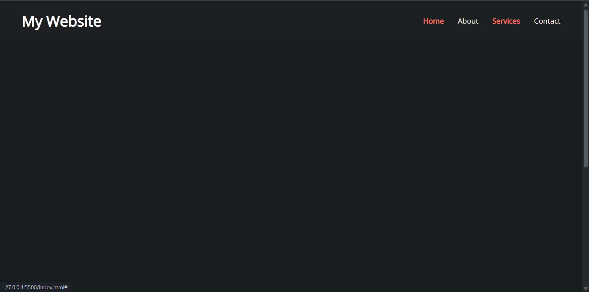

# Day 25 - Sticky Navbar

This project shows a fixed navigation bar that changes style when the user scrolls, creating a polished sticky header interaction.

## Overview

This project demonstrates a sticky navigation effect with a responsive header transition. The main goal was to improve the header UI by making the navbar adapt visually as the page scrolls.

## Features

- Sticky navigation that remains fixed at the top of the viewport
- Header style change on scroll for improved readability
- Smooth transition for background and padding adjustments
- Simple responsive layout using CSS and semantic HTML
- Minimal JavaScript for scroll-based enhancement
- Lightweight implementation with no external libraries

## Technologies Used

- HTML5
- CSS3 (transitions, fixed positioning)
- JavaScript (ES6+)

## What I Learned

- How to detect scroll position with `window.scrollY`
- How to toggle classes to change header styling dynamically
- How to use CSS transitions for smooth visual changes
- How fixed positioning affects layout and content flow
- How to keep enhancement logic minimal and performant

## Screenshot

## Live Demo

[View Project](#)

## Project Structure

- `index.html` — main page structure and navigation markup
- `style.css` — styling for the sticky navbar and page layout
- `script.js` — JavaScript to add/remove the active scroll class

## How to Run

1.  Open `index.html` in a web browser or start a local server
2.  Scroll the page to see the navbar style change
3.  Observe the sticky behavior and smooth transition

## Notes

- The navbar becomes active after scrolling past its height plus extra offset
- The effect is driven by CSS transition and background color changes
- The page uses semantic HTML with a fixed header and hero section
- The JavaScript is intentionally minimal and runs on DOM load

## Credits

Built as part of the `50 Days 50 Projects` challenge.
