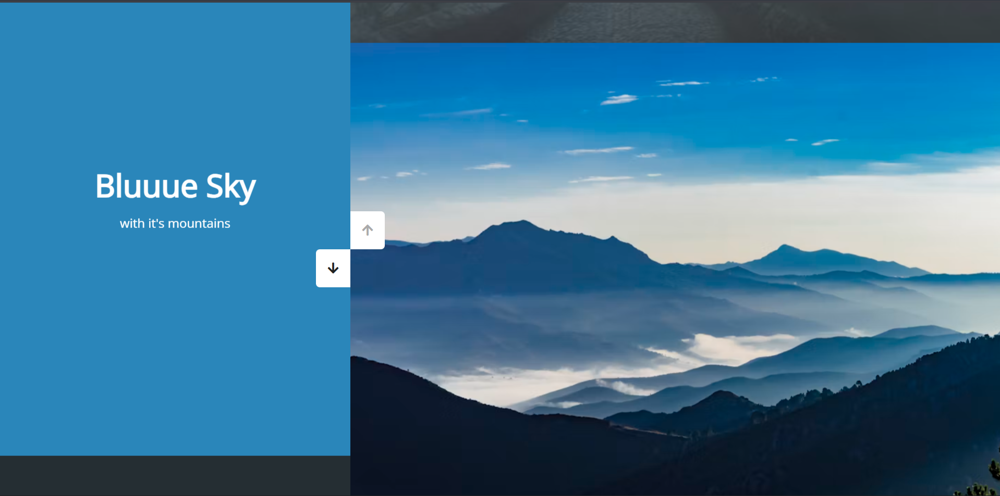

# Day 26 - Double Vertical Slider

A double vertical slider with synchronized panels creates a polished split-screen transition effect between color panels and background images.

## Overview

This project demonstrates a dual-panel vertical carousel with synchronized sliding transitions. The main goal was to build a smooth visual interaction that showcases coordinated movement between text panels and image panels.

## Features

- Opposite-direction synchronized vertical sliding panels
- Smooth transitions using CSS transforms and JavaScript control
- Simple up/down navigation buttons for intuitive interaction
- Responsive full-screen layout for immersive display
- Clean split-screen visual design with bold background colors and imagery
- Lightweight JavaScript for logic and enhancement

## Technologies Used

- HTML5
- CSS3 (transforms, transitions, positioning)
- JavaScript (ES6+)

## What I Learned

- How to synchronize paired slide panels using inverse transforms
- Using `translateY` for smooth vertical motion
- Managing active slide state with minimal JavaScript
- Positioning split-screen layouts with absolute layering
- Keeping transition effects performant with transform-based animation

## Screenshot

## Live Demo

[View Project](#)

## Project Structure

- `index.html` — markup for the double vertical slider layout and navigation controls
- `style.css` — styling for split-screen panels, transitions, and responsive layout
- `script.js` — slider logic for changing active slides and coordinating panel movement

## How to Run

1.  Open `index.html` in a web browser or start a local server
2.  Click the up and down buttons to move through the slider panels
3.  Observe the synchronized panel transitions and visual changes

## Notes

- The left panel uses inverse vertical translation to stay aligned with the right panel
- The effect is driven by CSS `transform` and transition timing for smooth sliding
- The JavaScript is intentionally minimal and only updates transforms on button clicks
- Slide height is calculated from the container height for full-screen coverage

## Credits

Built as part of the `50 Days 50 Projects` challenge.
