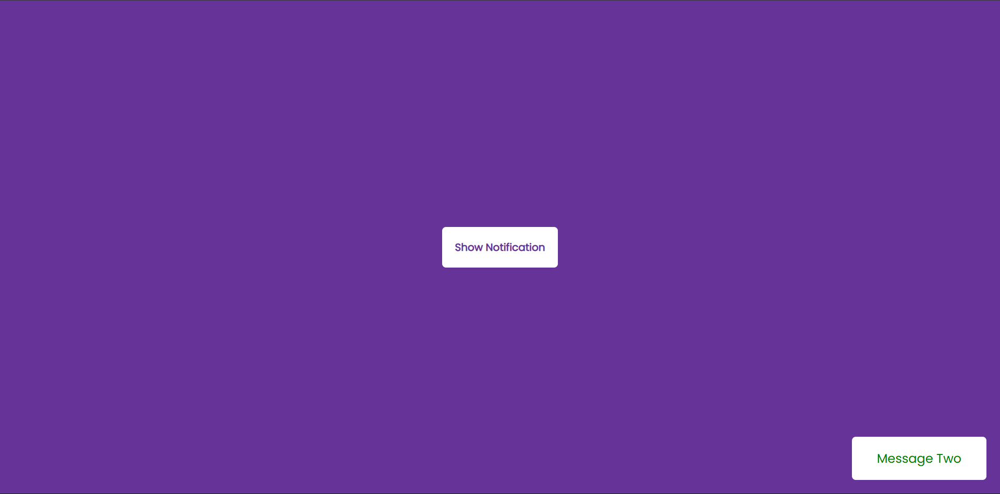

# Day 27 - Toast Notification

This project shows a simple toast-notification UI that generates small feedback messages with different styles and automatic dismissal.

## Overview

This project demonstrates dynamic toast notifications for user feedback. The main goal was to create a lightweight interaction that shows temporary messages with visual variety and smooth removal.

## Features

- Randomized toast messages and styles
- Auto-dismiss notifications after a short delay
- Distinct info, success, and error visual states
- Minimal, centered layout with a single action button
- Lightweight JavaScript for notification generation
- Simple CSS-based styling and transitions

## Technologies Used

- HTML5
- CSS3
- JavaScript (ES6+)

## What I Learned

- Generating and appending UI elements dynamically with JavaScript
- Using CSS classes to style different notification states
- Managing temporary DOM elements with timers
- Keeping interactions simple and user-friendly
- Building a compact, reusable notification pattern

## Screenshot

## Live Demo

[View Project](#)

## Project Structure

- `index.html` — main HTML structure for the button and toast container
- `style.css` — styling for the layout, button, and notification states
- `script.js` — JavaScript logic for creating and removing toasts

## How to Run

1. Open `index.html` in a web browser or start a local server
2. Click the Show Notification button to trigger a toast
3. Observe the message appear and disappear automatically

## Notes

- Toasts are created with random messages and types
- Notifications are removed after 3 seconds
- The UI uses a fixed-position container for stackable messages
- The JavaScript remains intentionally minimal and easy to customize

## Credits

Built as part of the `50 Days 50 Projects` challenge.
