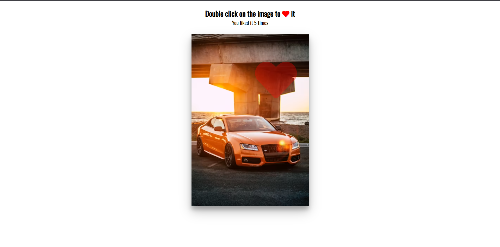

# Day 29 - Double Click Heart

Double-click the image to spawn animated hearts where you click — each double-click creates a heart that grows and fades and increments a like counter.

## Overview

This project demonstrates detecting double-click interactions and creating animated, positioned heart icons. The main goal was to precisely position animated elements based on click coordinates and implement a lightweight like counter while keeping animations performant and minimal.

## Features

- Animated heart icons created at the click position on double-click
- Double-click detection with a small timing threshold for user-friendly interaction
- Incrementing like counter displayed above the image
- CSS keyframe animation using transforms and opacity for smooth, performant effects
- Uses Font Awesome for the heart icon
- Minimal JavaScript for DOM creation and cleanup (lightweight and easy to understand)

## Technologies Used

- HTML5
- CSS3 (transforms, keyframes)
- JavaScript (ES6+)
- Font Awesome (icon set)

## What I Learned

- Calculating click position relative to an element using `clientX`/`clientY` and element offsets
- Implementing a simple double-click detection by measuring time between clicks
- Driving animations with CSS `transform` and `opacity` for good performance
- Creating and removing DOM elements dynamically to keep the DOM clean
- Keeping interaction logic minimal while preserving UX responsiveness

## Screenshot

## Live Demo

[View Project](#)

## Project Structure

- [index.html](index.html) — Main HTML markup and Font Awesome import
- [style.css](style.css) — Styles and keyframe animation for the hearts
- [script.js](script.js) — Double-click detection, heart creation, and counter logic

## How to Run

1.  Open [index.html](index.html) in a web browser or start a local server
2.  Double-click the image area to trigger the heart animation
3.  Observe the like counter increment and the animated hearts appearing at the click location

## Notes

- Double-click threshold: the script checks for two clicks within ~800ms to register a double-click
- Each heart is an `<i>` element with Font Awesome classes; its position is calculated by subtracting the element's `offsetLeft/offsetTop` from the `clientX/clientY` of the event
- Hearts are removed after 1 second (`setTimeout`) to avoid DOM buildup
- The animation scales the icon with `transform: translate(-50%, -50%) scale(...)` and fades via `opacity` for a smooth GPU-accelerated effect
- JavaScript is intentionally minimal and runs on DOM events only (no frameworks or build step required)

## Credits

Built as part of the `50 Days 50 Projects` challenge.
