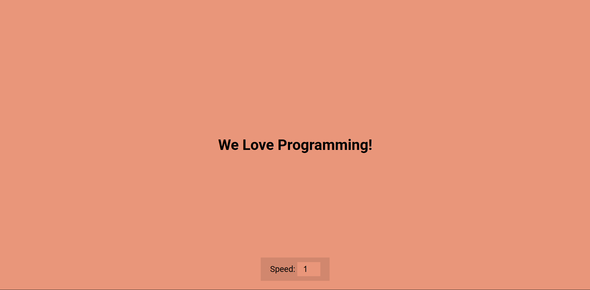

# Day 30 - Auto Text Effect

Watch text reveal itself character-by-character in a continuous typing animation, with real-time speed control to adjust the animation pace.

## Overview

This project demonstrates a typing animation effect where text is revealed one character at a time in a smooth, continuous loop. The main goal was to implement dynamic text animation with user-controlled speed adjustment through a simple number input.

## Features

- Character-by-character text animation with automatic looping
- Real-time speed control via adjustable input slider (1-10 scale)
- Smooth cycling through the same text repeatedly
- Clean, centered layout with minimal UI elements
- Responsive design that works on different screen sizes
- Lightweight JavaScript that efficiently manages animation timing
- No external animation libraries—pure vanilla JavaScript implementation

## Technologies Used

- HTML5
- CSS3 (flexbox, positioning, styling)
- JavaScript (ES6+)

## What I Learned

- Using `String.slice()` to progressively reveal text by character index
- Dynamically adjusting animation timing based on user input (inverse speed calculation)
- Implementing a looping animation pattern with `setTimeout` and index management
- Calculating speed as an inverse ratio (300ms / input value) for intuitive user control
- Structuring event listeners to update animation behavior in real-time without restarting
- Creating a centered, full-viewport layout with flexbox for optimal UX
- Keeping JavaScript minimal and focused on core animation logic

## Screenshot

## Live Demo

[View Project](#)

## Project Structure

- `index.html` — Main HTML file with text display element and speed control input
- `script.js` — JavaScript handling text animation loop and speed adjustment logic
- `style.css` — Styling for centered layout, text appearance, and input styling

## How to Run

1. Open `index.html` in a web browser
2. Observe the text "We Love Programming!" animating character-by-character on the page
3. Use the speed slider (1-10) to adjust how fast the text appears and loops
4. Higher numbers = faster animation; lower numbers = slower animation

## Notes

- The animation uses a numeric index that increments with each character reveal, then resets to 1 when reaching the end of the text
- Speed calculation uses `300 / speedEl.value` to create an inverse relationship—as the input value increases, the timeout delay decreases, making animation faster
- The `input` event listener updates speed in real-time without needing to restart the animation
- Text loops automatically by resetting `idx` to 1 when it exceeds the text length
- The layout uses `height: 100vh` and flexbox to fill the entire viewport and center all content
- The input field has a transparent background matching the body color for a cohesive visual style

## Credits

Built as part of the `50 Days 50 Projects` challenge.
