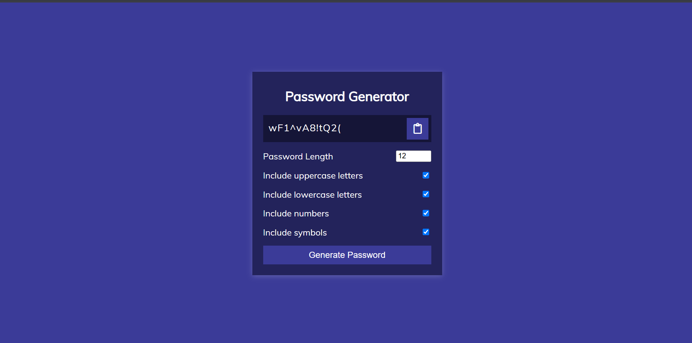

# Day 31 - Password Generator

This project presents a simple password generator that creates secure passwords with customizable length and character types. The main goal was to build an interactive UI that helps users quickly generate strong passwords while keeping the experience intuitive.

## Overview

This project demonstrates a password generation tool with adjustable settings for uppercase letters, lowercase letters, numbers, and symbols. The main goal was to create a clean and accessible experience for generating secure passwords with user-controlled complexity.

## Features

- Adjustable password length from 4 to 20 characters
- Toggle options for uppercase letters, lowercase letters, numbers, and symbols
- One-click password generation with instant results
- Clipboard copy button for quickly copying the generated password
- Minimal and responsive layout suitable for small screens
- Lightweight JavaScript logic for password creation and UI interaction

## Technologies Used

- HTML5
- CSS3
- JavaScript (ES6+)

## What I Learned

- Building a generator that respects user-selected character rules
- Using DOM events to connect form controls with dynamic output
- Implementing clipboard functionality in the browser
- Creating a clean UI with simple stateful interactions
- Keeping the code lightweight while maintaining usability

## Screenshot

## Live Demo

[View Project](#)

## Project Structure

- index.html — Contains the UI structure for the password generator
- style.css — Provides styling for the layout, controls, and button states
- script.js — Handles password generation, settings, and clipboard actions

## How to Run

1. Open index.html in a web browser or start a local server
2. Adjust the password length and character options
3. Click Generate Password to create a new password

## Notes

- The generator ensures at least one character type is selected before producing a password
- Password characters are chosen randomly from the enabled categories
- The clipboard button copies the current password to the system clipboard
- The JavaScript is intentionally minimal and focused on core functionality

## Credits

Built as part of the `50 Days 50 Projects` challenge.
