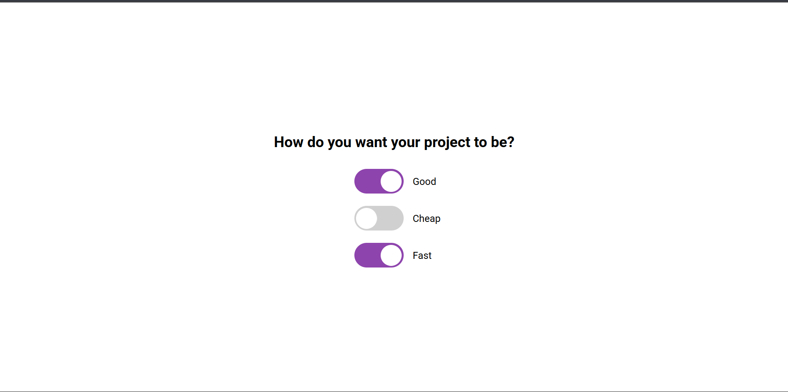

# Day 32 - Good, Cheap, Fast

This project showcases a simple toggle-based UI where users can choose between three priorities and see how they interact with one another.

## Overview

This project demonstrates a compact checkbox toggle interface with mutual exclusivity logic. The main goal was to create an engaging and intuitive way to show the classic trade-off between quality, cost, and speed.

## Features

- Three interactive toggle switches for Good, Cheap, and Fast
- Logic that prevents all three options from being selected at once
- Smooth animated slider movement for each toggle
- Clean, centered layout with responsive styling
- Lightweight JavaScript for the interaction behavior

## Technologies Used

- HTML5
- CSS3 (transitions, transforms, flexbox)
- JavaScript (ES6+)

## What I Learned

- How to build custom toggle switches with pure HTML and CSS
- Using CSS animations to make UI interactions feel more polished
- Implementing simple state logic in JavaScript for user-friendly behavior
- Structuring a minimal project with separate HTML, CSS, and JS files

## Screenshot

## Live Demo

[View Project](#)

## Project Structure

- `index.html` — Contains the three toggle controls and page structure
- `style.css` — Defines the layout, styling, and toggle animations
- `script.js` — Handles the checkbox logic for the mutual exclusivity rule

## How to Run

1. Open `index.html` in a web browser or start a local server
2. Toggle any of the three options on or off
3. Observe how the UI prevents all three from being selected simultaneously

## Notes

- The toggle switch uses a custom label and ball animation for a polished look
- The JavaScript logic ensures only two of the three options can remain active at once
- The project is intentionally simple and focuses on interaction design

## Credits

Built as part of the `50 Days 50 Projects` challenge.
