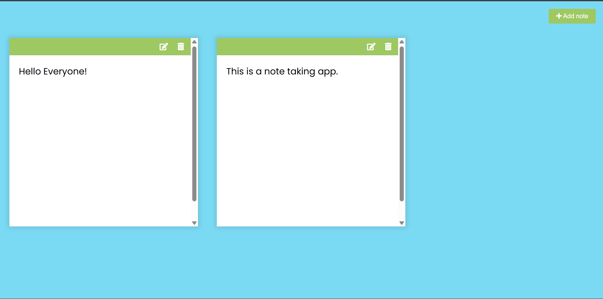

# Day 33 - Notes App

A lightweight markdown-enabled notes application that persists your thoughts to browser storage with real-time markdown preview and inline editing.

## Overview

This project demonstrates a functional note-taking web app with localStorage persistence and markdown rendering. The main goal was to create a simple, interactive UI for creating, editing, and deleting notes while instantly previewing markdown formatting.

## Features

- **Add New Notes**: Click the add button to instantly create a new note card
- **Real-time Markdown Preview**: See rendered markdown as you type using the marked.js library
- **Edit/View Toggle**: Switch between edit mode (textarea) and view mode (rendered HTML) with a single click
- **Delete Notes**: Remove notes with a delete button on each card
- **LocalStorage Persistence**: All notes are automatically saved to browser storage and restored on page reload
- **Responsive Layout**: Notes display as flexible cards that adapt to different screen sizes

## Technologies Used

- HTML5
- CSS3 (flexbox, styling, transitions)
- JavaScript (ES6+)
- marked.js (markdown rendering library)
- Font Awesome (icons)
- LocalStorage API

## What I Learned

- Using the marked.js library to convert markdown syntax into HTML
- Implementing edit/view toggle functionality with DOM element visibility control
- Persisting application state to localStorage and parsing JSON data on app initialization
- Event delegation and dynamic element creation for note management
- Building a functional UI with edit, delete, and add operations
- Real-time content synchronization between textarea input and preview display
- Managing application state across page reloads

## Screenshot

## Live Demo

[View Project](#)

## Project Structure

- `index.html` — HTML structure with add button and script references
- `script.js` — Core application logic for note creation, editing, deletion, and localStorage management
- `style.css` — Styling for the app layout, note cards, and buttons

## How to Run

1. Open `index.html` in a web browser
2. Click the green "Add note" button to create a new note
3. Type or paste markdown content into the textarea
4. Click the edit button to toggle between editing and preview mode
5. Use the delete button to remove unwanted notes
6. All notes are automatically saved and will persist when you reload the page

## Notes

- The marked.js library handles all markdown parsing and HTML conversion
- Notes are stored as plain text in localStorage under the key "notes"
- Each note card contains a textarea for editing and a main div for displaying rendered markdown
- The hidden class is toggled between textarea and main elements to switch modes
- The updateLS() function runs after every edit and deletion to keep localStorage synchronized
- Initial notes are loaded from localStorage on page load using JSON.parse()

## Credits

Built as part of the `50 Days 50 Projects` challenge.
