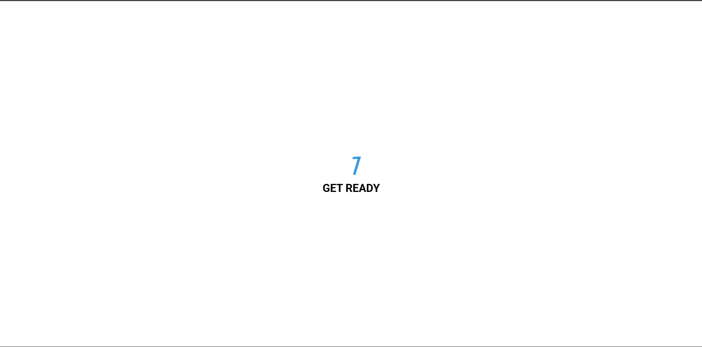

# Day 34 - Animated Countdown

This project showcases a playful animated countdown that transitions through numbers and ends with a bold "GO" message.

## Overview

This project demonstrates a timed number animation sequence using CSS and JavaScript. The main goal was to recreate the classic countdown effect with smooth transitions and a replay interaction.

## Features

- Number-by-number animation with staggered transitions
- Smooth entrance and exit effects for each countdown digit
- Replay button to restart the animation
- Minimal, centered layout with a polished final state
- Lightweight JavaScript to control the animation flow
- CSS-driven motion for a clean, modern visual effect

## Technologies Used

- HTML5
- CSS3 (animations, transforms, keyframes)
- JavaScript (ES6+)

## What I Learned

- Using CSS keyframes to create sequential motion effects
- Controlling animation flow with JavaScript event listeners
- Combining transforms and opacity for smooth visual polish
- Resetting DOM classes to replay animations cleanly
- Keeping the implementation lightweight and easy to follow

## Screenshot

## Live Demo

[View Project](#)

## Project Structure

- index.html — Contains the countdown layout and replay button
- style.css — Defines the visual styling and animation keyframes
- script.js — Handles the countdown sequence and replay behavior

## How to Run

1. Open index.html in a web browser or start a local server
2. Watch the countdown animate from 3 to 0
3. Click Replay to restart the animation sequence

## Notes

- The countdown digits are animated through CSS classes that change on animation completion
- The effect relies on transform-based motion for smooth performance
- The final state appears after the last number finishes its exit animation
- The JavaScript keeps the logic simple and reusable

## Credits

Built as part of the `50 Days 50 Projects` challenge.
