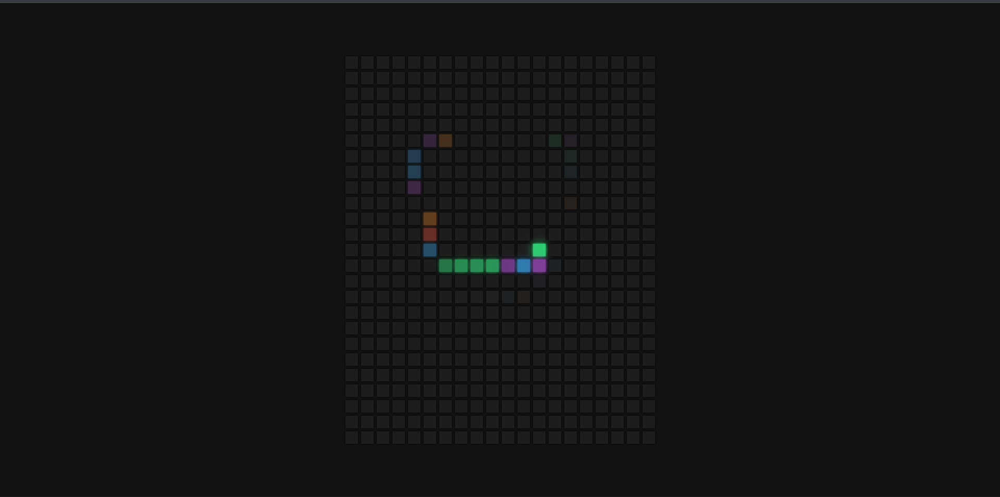

# Day 36 - Hoverboard

This project creates a colorful interactive grid where hovering over each square lights it up with a vibrant glow and dynamic color transition.

## Overview

This project demonstrates a hover-based visual effect built with a grid of squares. The main goal was to create an engaging, animated interaction using simple HTML, CSS, and JavaScript.

## Features

- Interactive squares that change color on hover
- Smooth glowing effects with animated box shadows
- Lightweight JavaScript that generates the board dynamically
- Minimal, clean layout centered in the viewport
- Responsive and easy-to-run single-page experience
- No external libraries required

## Technologies Used

- HTML5
- CSS3
- JavaScript (ES6+)

## What I Learned

- How to generate many DOM elements efficiently with JavaScript
- Using CSS transitions and box-shadow effects for visual feedback
- Creating simple hover interactions that feel polished and playful
- Managing state and styling through small, focused functions
- Building a compact project that delivers a strong visual effect with minimal code

## Screenshot

## Live Demo

[View Project](#)

## Project Structure

- `index.html` — Contains the main page structure and the container for the hoverboard
- `style.css` — Defines the layout, square styling, and hover transition effects
- `script.js` — Generates the squares and handles the color-changing interaction

## How to Run

1. Open `index.html` in a web browser or start a local server
2. Move your cursor over the squares to see the colors and glow effects
3. Observe how the hover effect resets when the pointer leaves each square

## Notes

- The hoverboard is created dynamically by appending square elements with JavaScript
- Each square uses a short transition so the color change feels smooth
- The effect is intentionally simple and lightweight for easy learning and customization
- The project is ideal for practicing DOM manipulation and CSS animation basics

## Credits

Built as part of the `50 Days 50 Projects` challenge.
