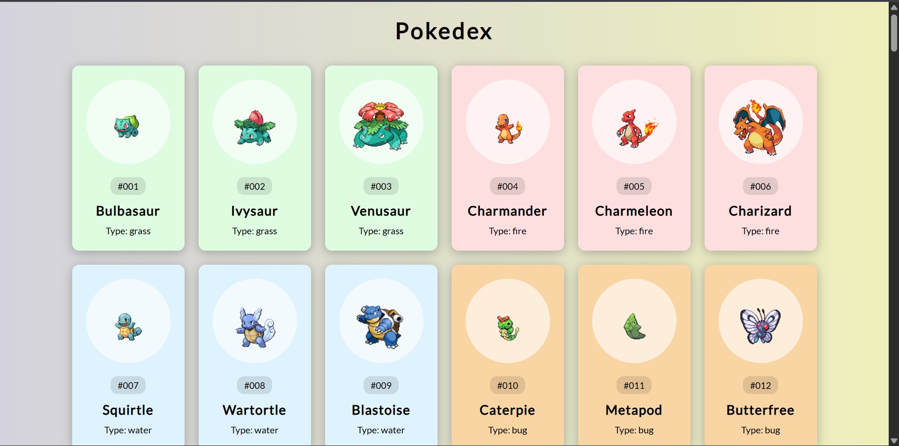

# Day 37 - Pokedex

This project presents a colorful, interactive Pokédex that fetches and displays Pokémon cards dynamically from the PokeAPI. The experience combines responsive card styling with live data loading to create a polished gallery of the first 150 Pokémon.

## Overview

This project demonstrates how to build a dynamic UI by fetching external API data and rendering it into reusable cards. The main goal was to practice asynchronous JavaScript, DOM manipulation, and visually appealing card-based layouts.

## Features

- Dynamic Pokémon card generation from the PokeAPI
- Color-coded cards based on each Pokémon's primary type
- Responsive layout with centered card grouping
- Clean visual styling with image containers and type badges
- Lightweight JavaScript for fetching and rendering data

## Technologies Used

- HTML5
- CSS3 (flexbox, gradients, shadows)
- JavaScript (ES6+, async/await, fetch)
- PokeAPI

## What I Learned

- Working with asynchronous JavaScript using fetch and async/await
- Rendering dynamic content into the DOM based on API responses
- Using CSS variables and color mapping for visual consistency
- Structuring reusable functions for API calls and card creation
- Building a polished UI from simple HTML, CSS, and JavaScript

## Screenshot

## Live Demo

[View Project](#)

## Project Structure

- `index.html` — Main HTML structure for the Pokédex page
- `style.css` — Styling for the layout, cards, and Pokémon visuals
- `script.js` — Logic for fetching Pokémon data and rendering cards

## How to Run

1. Open `index.html` in a web browser or start a local server
2. Wait for the Pokémon cards to load from the API
3. Browse the generated Pokédex and view each card's details

## Notes

- The app fetches data for the first 150 Pokémon by default
- Card colors are assigned according to the Pokémon's primary type
- The project uses the official PokeAPI sprites for each card image
- The JavaScript is intentionally simple and focuses on clean data handling

## Credits

Built as part of the `50 Days 50 Projects` challenge.
