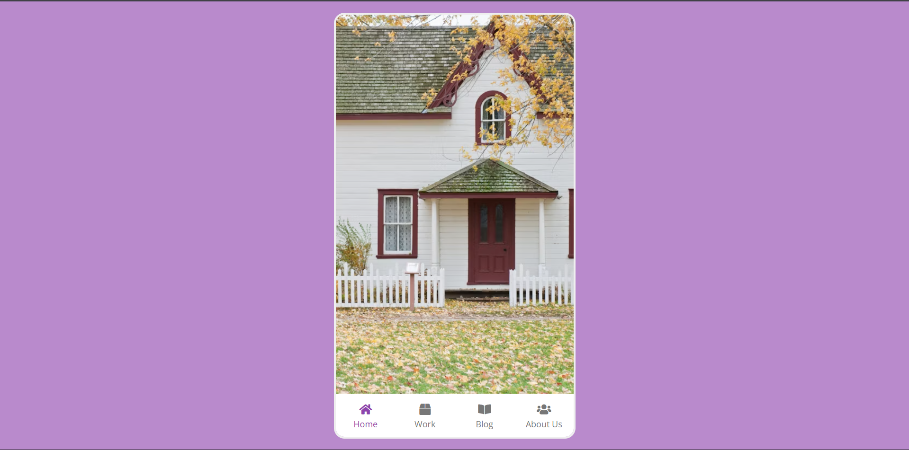

# Day 38 - Mobile Tab Navigation

This project showcases a compact mobile-style tab navigation interface with animated content switching and a polished bottom navigation bar.

## Overview

This project demonstrates a responsive tabbed mobile UI where selecting a navigation item updates the visible content panel. The main goal was to recreate the feel of a mobile app navigation experience using simple HTML, CSS, and JavaScript.

## Features

- Interactive bottom navigation with active state highlighting
- Smooth content switching between multiple panels
- Clean, mobile-friendly layout with rounded phone frame
- Lightweight JavaScript for tab selection logic
- Minimal styling that emphasizes usability and clarity

## Technologies Used

- HTML5
- CSS3
- JavaScript (ES6+)

## What I Learned

- Managing tab state with plain JavaScript and DOM selection
- Using CSS transitions to create smooth content changes
- Structuring a compact UI around a single container and reusable components
- Building a responsive, app-like interface with minimal code

## Screenshot

## Live Demo

[View Project](#)

## Project Structure

- `index.html` — Contains the phone layout, tab buttons, and content panels
- `style.css` — Defines the visual styling, layout, and active tab appearance
- `script.js` — Handles tab switching and content visibility

## How to Run

1. Open `index.html` in a web browser or start a local server
2. Click on any tab in the bottom navigation
3. Observe the active tab highlight and content panel change

## Notes

- The content panels are shown and hidden using CSS classes and JavaScript
- The layout is designed to resemble a mobile device interface
- The project uses a simple, accessible navigation pattern suitable for small screens

## Credits

Built as part of the `50 Days 50 Projects` challenge.
