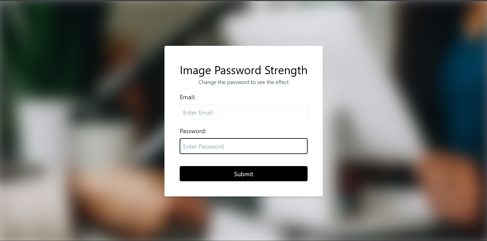

# Day 39 - Password Strength Background

This project creates a dynamic background blur effect that intensifies as the password input becomes weaker, making the visual feedback feel interactive and intuitive.

## Overview

This project demonstrates a simple password strength visualization using JavaScript and CSS. The main goal was to build a responsive UI that reacts to password input length by changing the background blur in real time.

## Features

- Real-time background blur adjustment based on password length
- Clean, centered login-style card layout
- Minimal, lightweight JavaScript for input-driven effects
- Responsive styling with a polished, modern look
- Simple form structure with email and password fields

## Technologies Used

- HTML5
- CSS3
- JavaScript (ES6+)
- Tailwind CSS

## What I Learned

- Using DOM input events to trigger visual updates
- Applying CSS filters to create dynamic UI feedback
- Balancing visual effect and usability in form interactions
- Keeping JavaScript logic minimal while preserving a strong user experience

## Screenshot

## Live Demo

[View Project](#)

## Project Structure

- `index.html` — Main HTML structure for the form and background container
- `style.css` — Layout and background blur styling
- `script.js` — Handles password input and updates the blur effect

## How to Run

1. Open `index.html` in a web browser or start a local server
2. Type into the password field
3. Observe how the background blur changes as the password length changes

## Notes

- The blur intensity is tied directly to the number of characters entered
- The effect is achieved with a CSS filter applied to the background element
- The project uses a simple, focused interaction to demonstrate real-time UI feedback

## Credits

Built as part of the `50 Days 50 Projects` challenge.
