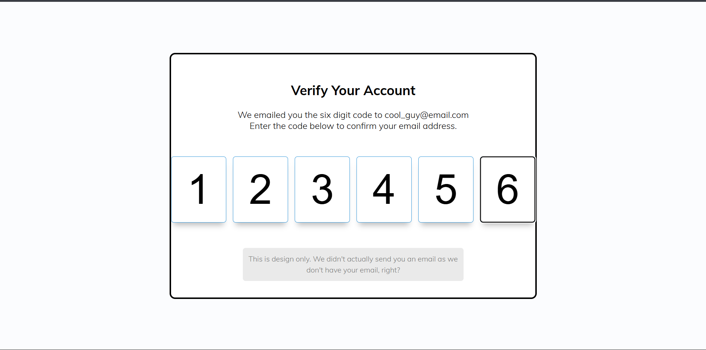

# Day 41 - Verify Account UI

This project recreates a polished verification-code entry experience with a focus on smooth, keyboard-friendly input flow. The interface feels like a real account confirmation form, with each digit field guiding the user through the six-step entry process.

## Overview

This project demonstrates a compact verification form with multi-input code entry and interactive focus management. The main goal was to build a clean, responsive UI that makes entering a six-digit code feel intuitive and polished.

## Features

- Six individual input boxes for code entry with a compact, modern layout
- Automatic focus movement as each digit is entered
- Backspace navigation that moves focus to the previous field
- Responsive styling that adapts well to smaller screens
- Visual validation states that highlight completed input fields
- Lightweight JavaScript for the input logic and focus behavior

## Technologies Used

- HTML5
- CSS3
- JavaScript (ES6+)

## What I Learned

- Managing multiple form inputs as a single interactive experience
- Using JavaScript to improve keyboard usability for form entry
- Styling input states to create clear visual feedback
- Building a responsive layout that remains usable on mobile screens
- Keeping the interaction simple while maintaining a polished UI feel

## Screenshot

## Live Demo

[View Project](#)

## Project Structure

- `index.html` — Contains the verification form structure and six digit input fields
- `style.css` — Provides the visual styling, layout, and responsive behavior
- `script.js` — Handles focus movement and keyboard navigation for the code inputs

## How to Run

1. Open `index.html` in a web browser or start a local server
2. Click into the first code box and type a six-digit code
3. Observe how focus moves automatically between inputs and how the form responds to Backspace

## Notes

- The inputs are styled to look like a verification code entry field with a modern card layout
- The JavaScript uses a simple event handler to manage typing and navigation
- The design uses CSS validation styling to emphasize completed fields
- The implementation is intentionally lightweight and easy to extend

## Credits

Built as part of the `50 Days 50 Projects` challenge.
