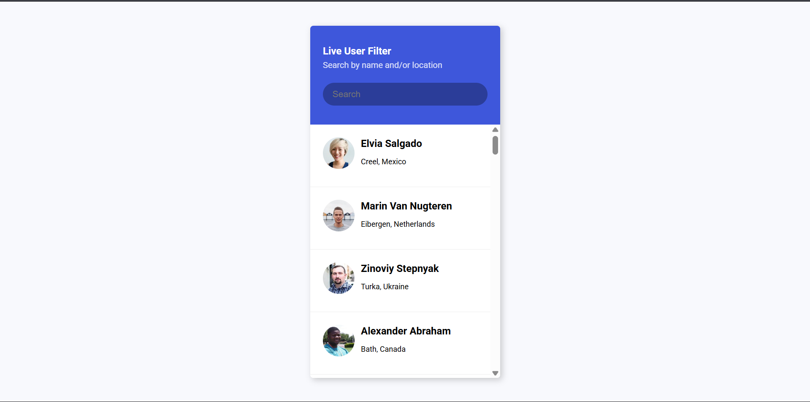

# Day 42 - Live User Filter

This project creates a responsive, real-time user directory that filters results instantly as you type.

## Overview

This project demonstrates a live search interface for a list of users fetched from an external API. The main goal was to build a smooth filtering experience that updates as the user types without reloading the page.

## Features

- Real-time filtering as the search input changes
- Instant hiding and showing of matching and non-matching users
- Clean card-style layout for each user profile
- Scrollable list with a polished, compact interface
- Lightweight JavaScript logic for fetching and updating the list
- Responsive design that works well in a small, centered container

## Technologies Used

- HTML5
- CSS3 (flexbox, box shadows, scrolling)
- JavaScript (ES6+, async/await, DOM manipulation)
- Random User API

## What I Learned

- Handling async data fetching and rendering dynamically
- Updating the DOM efficiently while keeping the UI responsive
- Using class toggling to show or hide filtered items
- Creating a simple but polished search experience with minimal code
- Working with API data and formatting it for display

## Screenshot

## Live Demo

[View Project](#)

## Project Structure

- index.html — contains the layout for the filter input and user list
- style.css — styles the container, header, cards, and list interactions
- script.js — fetches user data and filters the results live

## How to Run

1. Open index.html in a web browser or start a local server
2. Type into the search box to filter users by name or location
3. Observe the list updating instantly as you type

## Notes

- User data is fetched from the Random User API
- Matching is based on the visible text content of each list item
- The list uses a simple hide/show class to control visibility
- The implementation is intentionally lightweight and easy to follow

## Credits

Built as part of the 50 Days 50 Projects challenge.
