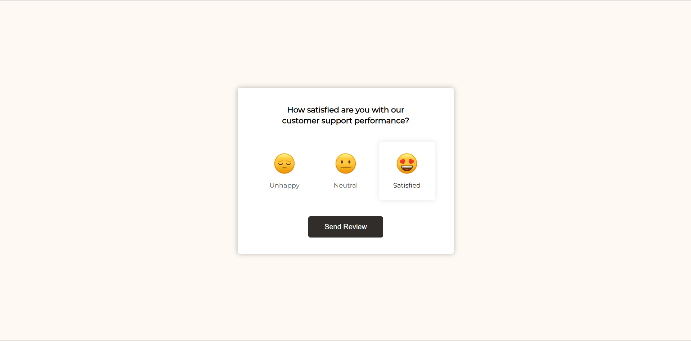

# Day 43 - Feedback UI Design

A compact feedback card lets users choose a satisfaction level and submit a polished review experience with a clear confirmation state.

## Overview

This project demonstrates a simple interactive feedback UI where users can select a rating and submit their review. The main goal was to create a clean, engaging experience that highlights user selection and provides a satisfying completion state.

## Features

- Interactive rating selection with active-state highlighting
- Smooth hover and selection transitions for each option
- Confirmation screen after the review is submitted
- Minimal, responsive layout suited for small screens
- Lightweight JavaScript for state handling and UI updates
- Clear visual feedback using emoji-based rating choices

## Technologies Used

- HTML5
- CSS3 (flexbox, transitions, hover effects)
- JavaScript (ES6+)

## What I Learned

- Using simple DOM events to manage interactive UI state
- Styling selected states with CSS classes for clear feedback
- Creating a smooth transition from form to confirmation view
- Building a compact UI that remains readable and responsive
- Keeping the JavaScript logic lightweight while preserving usability

## Screenshot

## Live Demo

[View Project](#)

## Project Structure

- `index.html` — Contains the feedback panel structure and rating options
- `style.css` — Defines the layout, styling, transitions, and visual polish
- `script.js` — Handles rating selection and submission feedback behavior

## How to Run

1. Open `index.html` in a web browser or start a local server
2. Click one of the rating options to select your feedback
3. Press the Send Review button to view the confirmation state

## Notes

- The selected rating is stored in JavaScript and displayed after submission
- CSS transitions help make the interaction feel more responsive and polished
- The layout is intentionally minimal to focus attention on the feedback experience

## Credits

Built as part of the `50 Days 50 Projects` challenge.
