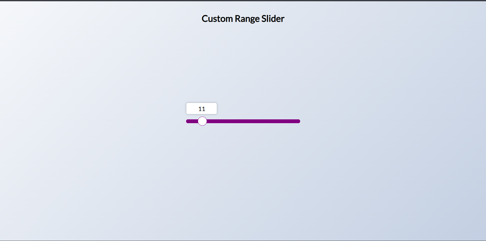

# Day 44 - Custom Range Slider

This project showcases a custom-styled range slider with a live label that moves and updates as the slider value changes.

## Overview

This project demonstrates how to create a visually polished custom range slider using HTML, CSS, and a small amount of JavaScript. The main goal was to build an interactive input that feels more refined than the browser default while keeping the implementation simple.

## Features

- Custom-styled slider track and thumb
- Dynamic label that updates with the current value
- Label positioning that follows the slider thumb as it moves
- Clean, centered layout with a modern gradient background
- Lightweight JavaScript for value tracking and label movement

## Technologies Used

- HTML5
- CSS3
- JavaScript (ES6+)

## What I Learned

- How to style native range inputs across browsers
- How to calculate and position a floating label based on the current slider value
- How to use JavaScript to update UI state in response to input events
- How to combine CSS and JavaScript to create a more polished form control

## Screenshot

## Live Demo

[View Project](#)

## Project Structure

- `index.html` — Contains the slider markup and label element
- `style.css` — Defines the custom styling, layout, and slider appearance
- `script.js` — Handles slider input events and updates the label position/value

## How to Run

1. Open `index.html` in a web browser or start a local server
2. Drag the slider to change its value
3. Observe the moving label and updated value display

## Notes

- The label is positioned dynamically based on the slider's current value
- The slider uses browser-specific pseudo-elements for custom track and thumb styling
- The JavaScript is intentionally minimal and focused on interactivity

## Credits

Built as part of the `50 Days 50 Projects` challenge.
