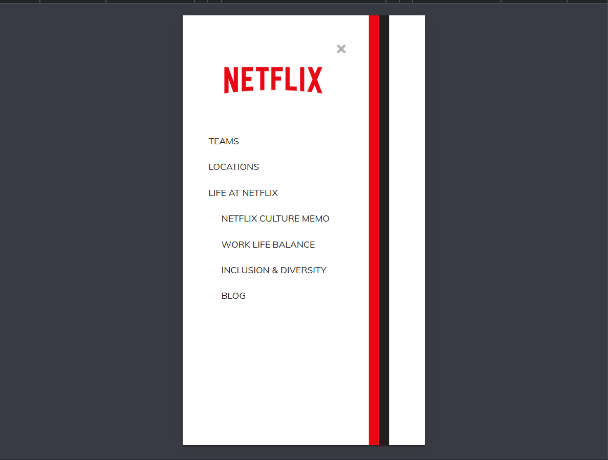

# Day 45 - Netflix Mobile Navigation

This project recreates a Netflix-style mobile navigation experience with a slide-out menu and layered panels that open smoothly from the side.

## Overview

This project demonstrates a multi-layered mobile navigation menu with animated panel transitions. The main goal was to recreate the familiar Netflix mobile menu interaction while practicing CSS transitions and simple DOM-based toggling.

## Features

- Three-layer slide-out navigation with staggered reveal timing
- Smooth open and close transitions driven by CSS transforms
- Clear menu structure with nested links and a close button
- Responsive sidebar layout suited to smaller screens
- Minimal JavaScript for toggling visibility states

## Technologies Used

- HTML5
- CSS3 (transitions, transforms, positioning)
- JavaScript (ES6+)

## What I Learned

- Using nested elements to create layered animation effects
- Controlling transition timing with delay for a polished reveal
- Managing open and close state with a small JavaScript helper
- Styling fixed-position overlays for mobile navigation patterns

## Screenshot

## Live Demo

[View Project](#)

## Project Structure

- `index.html` — Main structure for the page and menu markup
- `style.css` — Styling for the slide-out panels, layout, and transitions
- `script.js` — JavaScript for opening and closing the navigation

## How to Run

1. Open `index.html` in a web browser or start a local server
2. Click the menu button to open the navigation
3. Observe the layered panels slide in and use the close button to dismiss them

## Notes

- The navigation uses three stacked `.nav` elements to create the layered effect
- Each panel has its own transition delay to create a smooth reveal
- The menu is fixed-positioned so it behaves like a mobile drawer
- The JavaScript is intentionally minimal and focused on toggling classes

## Credits

Built as part of the `50 Days 50 Projects` challenge.
