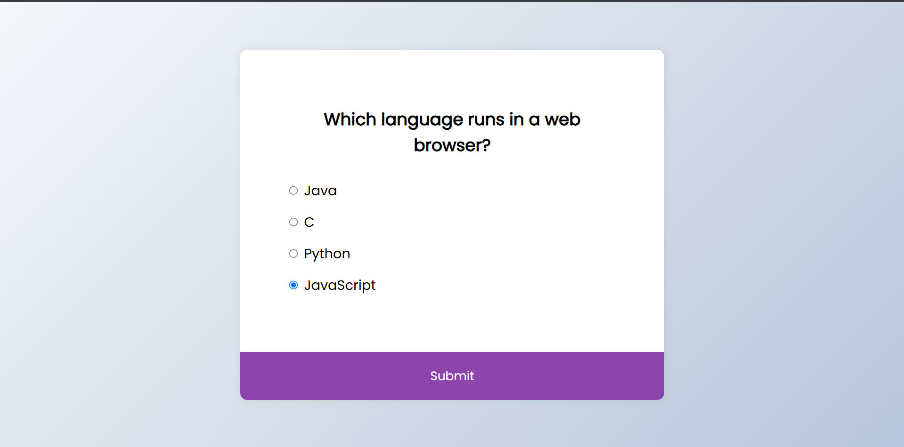

# Day 46 - Quiz App

This project is a simple interactive quiz application that lets users answer multiple-choice questions and see their score at the end.

## Overview

This project demonstrates a lightweight quiz experience built with HTML, CSS, and JavaScript. The main goal was to create a clean, interactive flow for presenting questions, collecting answers, and displaying results.

## Features

- Multiple-choice questions with selectable answers
- Score tracking across the quiz
- Dynamic question loading without page refresh
- Result screen showing correct answers out of total questions
- Responsive and minimal layout for easy use
- Lightweight JavaScript logic for quiz behavior

## Technologies Used

- HTML5
- CSS3
- JavaScript (ES6+)

## What I Learned

- Managing quiz state with JavaScript variables and DOM updates
- Dynamically rendering question content based on the current item
- Handling user input with radio buttons and selection logic
- Creating a simple result flow for completed quizzes
- Structuring a small interactive web app cleanly

## Screenshot

## Live Demo

[View Project](#)

## Project Structure

- `index.html` — Contains the quiz layout and answer options
- `style.css` — Styles the quiz container, buttons, and overall layout
- `script.js` — Handles quiz data, answer selection, scoring, and navigation

## How to Run

1. Open `index.html` in a web browser or start a local server
2. Select an answer for each question
3. Submit your answer and view your final score

## Notes

- The quiz uses radio inputs so only one answer can be selected at a time
- Questions and answer text are loaded dynamically from JavaScript data
- The app shows a final score screen after the last question is answered
- The JavaScript is intentionally simple and easy to follow

## Credits

Built as part of the `50 Days 50 Projects` challenge.
