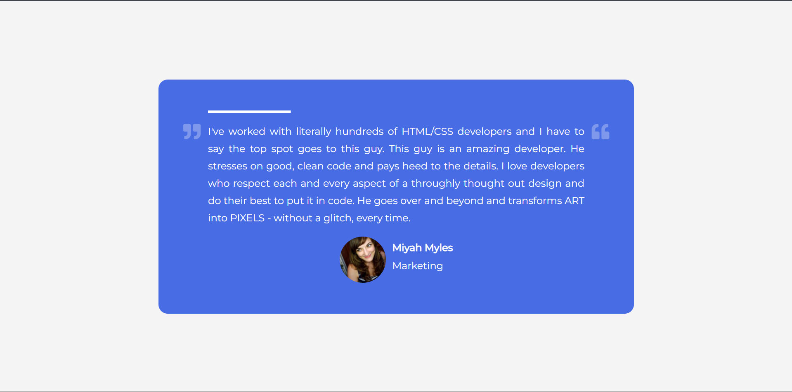

# Day 47 - Testimonial Box Switcher

A rotating testimonial card that automatically cycles through customer quotes while updating the profile details and progress indicator.

## Overview

This project demonstrates a dynamic testimonial carousel with timed content switching. The main goal was to create a polished, interactive UI that feels lively while keeping the implementation lightweight and easy to follow.

## Features

- Auto-advancing testimonials with a timed interval
- Progress bar animation that visually tracks the current slide
- Updated user image, name, and role for each testimonial
- Clean, centered layout with responsive spacing
- Minimal JavaScript logic for content switching

## Technologies Used

- HTML5
- CSS3 (flexbox, positioning, keyframes)
- JavaScript (ES6+)

## What I Learned

- Managing timed UI updates with JavaScript intervals
- Using CSS animation to create a progress indicator
- Updating multiple DOM elements together for smooth content changes
- Building a compact component that feels polished without heavy dependencies

## Screenshot

## Live Demo

[View Project](#)

## Project Structure

- `index.html` — Main HTML structure for the testimonial card
- `style.css` — Styling for layout, colors, typography, and progress bar animation
- `script.js` — JavaScript logic for cycling through testimonials

## How to Run

1. Open `index.html` in a web browser or start a local server
2. Wait for the testimonial to rotate automatically
3. Observe the progress bar and updated profile details

## Notes

- The testimonial content is stored in an array and updated with a simple index counter
- The progress bar uses a CSS animation to indicate the current rotation cycle
- The layout is designed to remain readable on smaller screens
- The JavaScript is intentionally minimal and focused on the transition logic

## Credits

Built as part of the `50 Days 50 Projects` challenge.
