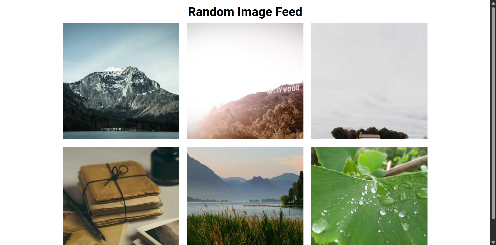

# Day 48 - Random Image Feed

A dynamic image gallery that fetches and displays random images in a responsive grid layout, pulling from the Picsum Photos API for a constantly refreshing visual feed.

## Overview

This project demonstrates fetching data from an external API and dynamically rendering DOM elements in a responsive grid. The main goal was to create an efficient image gallery that loads multiple random images and maintains a clean, centered layout that adapts to different screen sizes.

## Features

- Random image generation from the Picsum Photos API
- Responsive grid layout (2 rows × 3 columns)
- Dynamic DOM element creation with JavaScript
- Fixed image dimensions with proper aspect ratio
- Unique query parameters to ensure cache-busting on each load
- Smooth, centered layout with flexbox
- Cross-browser compatible

## Technologies Used

- HTML5
- CSS3 (flexbox, responsive design)
- JavaScript (ES6+)
- Picsum Photos API

## What I Learned

- Working with external APIs and constructing dynamic URLs
- Creating and appending DOM elements programmatically
- Using query parameters for cache-busting in image URLs
- Building responsive grid layouts with CSS flexbox
- Handling random number generation for varying image dimensions
- Proper object-fit for maintaining aspect ratios in image containers

## Screenshot

## Live Demo

[View Project](#)

## Project Structure

- `index.html` — HTML structure with container for images and script reference
- `style.css` — Responsive grid layout, typography, and image styling
- `script.js` — Image fetching logic, DOM element creation, and random size generation

## How to Run

1. Open `index.html` in a web browser or start a local server
2. The page automatically loads 6 random images on page load
3. Refresh the page to load a new set of random images

## Notes

- The Picsum Photos API is used instead of Unsplash for better reliability
- Each image URL includes a random query parameter to bypass browser cache
- Image dimensions are generated randomly between 300-400px to add visual variety
- Images use `object-fit: cover` to maintain aspect ratio within 300×300px containers
- The layout uses a fixed maximum width of 1000px with centered flexbox alignment
- All images have 10px margin spacing for visual separation

## Credits

Built as part of the `50 Days 50 Projects` challenge.
