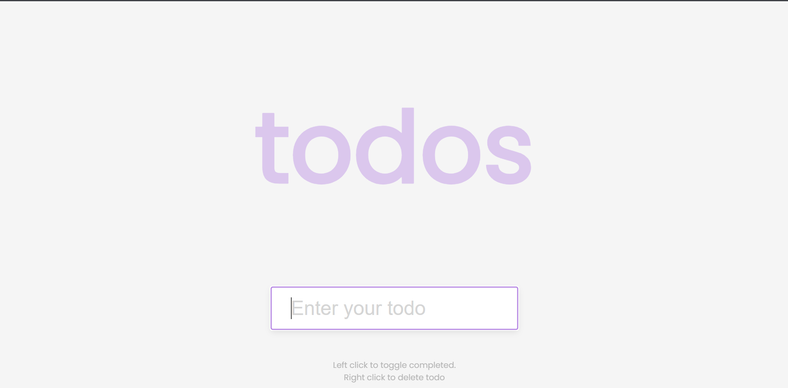

# Day 49 - Todo List

A simple todo list app that lets users add, complete, and delete tasks with a clean, interactive interface.

## Overview

This project demonstrates a lightweight task-management experience built with HTML, CSS, and JavaScript. The main goal was to create an intuitive app that stores todos in local storage so tasks persist across page refreshes.

## Features

- Add new todos from a text input
- Mark tasks as completed with a single click
- Delete tasks using a right-click interaction
- Persistent storage with localStorage for saved tasks
- Clean, minimal layout with polished styling
- Lightweight JavaScript for state management and DOM updates

## Technologies Used

- HTML5
- CSS3 (flexbox, transitions, responsive styling)
- JavaScript (ES6+)

## What I Learned

- Managing todo state with JavaScript and local storage
- Updating the DOM dynamically for adding and removing items
- Handling both click and contextmenu events for different interactions
- Styling interactive list items with hover and completed states
- Building a compact app with a simple, intuitive UX

## Screenshot

## Live Demo

[View Project](#)

## Project Structure

- `index.html` — Main HTML structure for the todo input and task list
- `style.css` — Styling for the layout, colors, and completed todo states
- `script.js` — JavaScript logic for creating, toggling, deleting, and saving todos

## How to Run

1.  Open `index.html` in a web browser or start a local server
2.  Enter a task in the input field and press Enter to add it
3.  Click a todo to mark it complete, or right-click to delete it

## Notes

- Todos are stored in browser localStorage so they remain after refresh
- Completed todos are visually styled with a line-through effect
- The app uses a minimal amount of JavaScript to keep the interaction simple and readable

## Credits

Built as part of the `50 Days 50 Projects` challenge.
