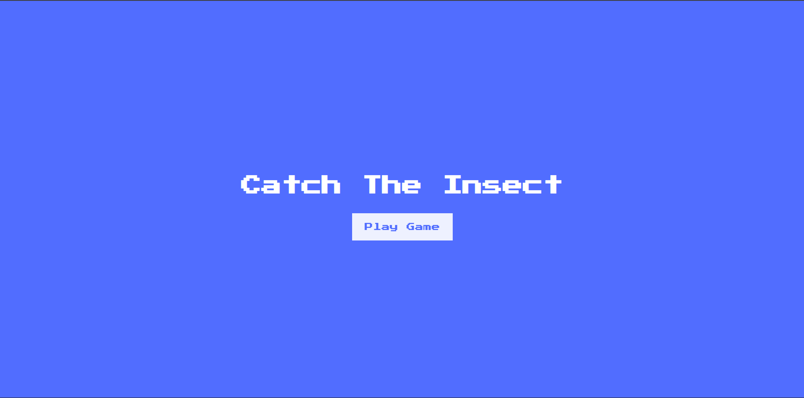

# Day 50 - Catch The Insect

A fast-paced browser game where players choose an insect and click as many moving targets as possible before the timer keeps going.

## Overview

This project demonstrates interactive game design and DOM-based animation in the browser. The main goal was to build a simple but engaging clicking game with multiple screens, random insect placement, scoring, and a playful UI.

## Features

- Multiple screens for starting, choosing an insect, and playing the game
- Randomly generated insect positions for varied gameplay
- Score tracking and a visible timer during play
- A message that appears when the player reaches a high score
- Responsive layout with a colorful, game-like interface
- Lightweight JavaScript for game logic and interaction

## Technologies Used

- HTML5
- CSS3 (flexbox, transitions, transforms)
- JavaScript (ES6+)

## What I Learned

- Creating interactive UI flows across multiple screens
- Generating and positioning elements dynamically with JavaScript
- Using CSS transforms for smooth animation effects
- Managing timing and cleanup with setTimeout and DOM updates
- Designing a simple game loop with score and state changes

## Screenshot

## Live Demo

[View Project](#)

## Project Structure

- `index.html` — Contains the game layout, screens, and insect selection UI
- `style.css` — Styles the interface, transitions, and insect animations
- `script.js` — Implements the game logic, score tracking, and insect generation

## How to Run

1. Open `index.html` in a web browser or start a local server
2. Click the Play Game button to begin
3. Choose an insect and start clicking the moving targets to increase your score

## Notes

- Insects are generated at random positions each time to keep gameplay unpredictable
- The game uses CSS transforms to animate insect capture and removal
- The score message becomes visible after the player reaches a high score threshold
- The JavaScript is intentionally minimal and focused on game behavior

## Credits

Built as part of the `50 Days 50 Projects` challenge.
