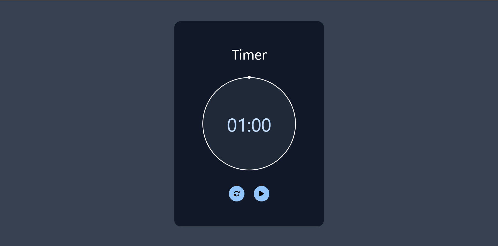

# Day 51 - Simple Timer

A compact countdown timer with a circular progress indicator that visually fills as time runs down.

## Overview

This project demonstrates a simple interactive timer built with HTML, CSS, and JavaScript. The main goal was to create a polished countdown experience with a circular progress ring and easy play/pause/reset controls.

## Features

- Circular progress indicator that updates as the timer counts down
- Play and pause controls with visual state changes
- Reset button to restart the countdown instantly
- Clean, centered layout with responsive sizing
- Lightweight JavaScript for timer logic and UI updates

## Technologies Used

- HTML5
- CSS3 (conic gradients, transforms, positioning)
- JavaScript (ES6+)
- Tailwind CSS

## What I Learned

- How to animate a circular progress effect using conic gradients
- How to update CSS variables dynamically with JavaScript
- How to manage timer state with play, pause, and reset interactions
- How to structure a small interactive UI with clean visual feedback

## Screenshot

## Live Demo

[View Project](#)

## Project Structure

- `index.html` — Main HTML structure for the timer UI
- `style.css` — Styles for the circular progress effect and layout
- `script.js` — Timer logic, state handling, and visual updates
- `screenshot.png` — Project preview image

## How to Run

1. Open `index.html` in a web browser or start a local server
2. Click the play button to start the countdown
3. Use the reset button to restart the timer at any time

## Notes

- The circular progress is controlled through a CSS variable updated by JavaScript
- The timer uses a 60-second countdown by default
- The play button switches between play and pause icons to reflect current state

## Credits

Built as part of the `50 Days 50 Projects` challenge.
